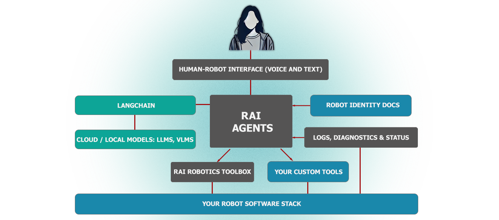

# RAI

RAI is a flexible AI agent framework to develop and deploy Embodied AI features for your robots.

📚 Visit [robotecai.github.io/rai](https://robotecai.github.io/rai/) for the latest documentation, setup
guide and tutorials. 📚

---

<div align="center">



---

[](https://opensource.org/licenses/Apache-2.0)


[](https://arxiv.org/abs/2505.07532)


[](https://discord.gg/3PGHgTaJSB)

</div>

---

## 🎯 Overview

| Category                       | Description                                       | Features                                                                                                                                                           |
| ------------------------------ | ------------------------------------------------- | ------------------------------------------------------------------------------------------------------------------------------------------------------------------ |
| 🤖 **Multi-Agent Systems**     | Empowering robotics with advanced AI capabilities | • Seamlessly integrate Gen AI capabilities into your robots<br>• Enable sophisticated agent-based architectures                                                    |
| 🔄 **Robot Intelligence**      | Enhancing robotic systems with smart features     | • Add natural human-robot interaction capabilities<br>• Bring flexible problem-solving to your existing stack<br>• Provide ready-to-use AI features out of the box |
| 🌟 **Multi-Modal Interaction** | Supporting diverse interaction capabilities       | • Handle diverse data types natively<br>• Enable rich sensory integration<br>• Process multiple input/output modalities simultaneously                             |

## RAI framework

-   [x] rai core: Core functionality for multi-agent system, human-robot interaction and
        multi-modalities.
-   [x] rai whoami: Tool to extract and synthesize robot embodiment information from a structured
        directory of documentation, images, and URDFs.
-   [x] rai_asr: Speech-to-text models and tools.
-   [x] rai_tts: Text-to-speech models and tools.
-   [x] rai_sim: Package for connecting RAI to simulation environments.
-   [x] rai_bench: Benchmarking suite for RAI. Test agents, models, tools, simulators, etc.
-   [x] rai_perception: Object detection tools based on open-set models and machine learning techniques.
-   [x] rai_nomad: Integration with NoMaD for navigation.
-   [ ] rai_finetune: Finetune LLMs on your embodied data.

### Getting started

See [Quick setup guide](https://robotecai.github.io/rai/setup/install).

### Simulation demos

Try RAI yourself with these demos:
| Application | Robot | Description | Docs Link |
| ------------------------------------------ | ------------------------ | ------------------------------------------------------------------------------------------------------------------------------------------------ | ------------------------------------------------------------- |
| Mission and obstacle reasoning in orchards | Autonomous tractor | In a beautiful scene of a virtual orchard, RAI goes beyond obstacle detection to analyze best course of action for a given unexpected situation. | [link](https://robotecai.github.io/rai/demos/agriculture/) |
| Manipulation tasks with natural language | Robot Arm (Franka Panda) | Complete flexible manipulation tasks thanks to RAI and Grounded SAM 2 | [link](https://robotecai.github.io/rai/demos/manipulation/) |
| Autonomous mobile robot demo | Husarion ROSbot XL | Demonstrate RAI's interaction with an autonomous mobile robot platform for navigation and control | [link](https://robotecai.github.io/rai/demos/rosbot_xl/) |

## Community

### Embodied AI Community Group

RAI is one of the main projects in focus of the
[Embodied AI Community Group](https://github.com/ros-wg-embodied-ai). If you would like to join the
next meeting, look for it in the
[ROS Community Calendar](https://calendar.google.com/calendar/u/0/embed?src=c_3fc5c4d6ece9d80d49f136c1dcd54d7f44e1acefdbe87228c92ff268e85e2ea0@group.calendar.google.com&ctz=Etc/UTC).

### Publicity

-   A talk about [RAI at ROSCon 2024](https://vimeo.com/1026029511).

### RAI Q&A

Please take a look at [Q&A](https://github.com/RobotecAI/rai/discussions/categories/q-a).

### Developer Resources

See our [documentation](https://robotecai.github.io/rai/) for a deeper dive into RAI, including
instructions on creating a configuration specifically for your robot.

### Contributing

You are welcome to contribute to RAI! Please see our [Contribution Guide](CONTRIBUTING.md).

### Citation

If you find our work helpful for your research, please consider citing the following BibTeX entry.

```bibtex
@misc{rachwał2025raiflexibleagentframework,
      title={RAI: Flexible Agent Framework for Embodied AI},
      author={Kajetan Rachwał and Maciej Majek and Bartłomiej Boczek and Kacper Dąbrowski and Paweł Liberadzki and Adam Dąbrowski and Maria Ganzha},
      year={2025},
      eprint={2505.07532},
      archivePrefix={arXiv},
      primaryClass={cs.MA},
      url={https://arxiv.org/abs/2505.07532},
}
```
