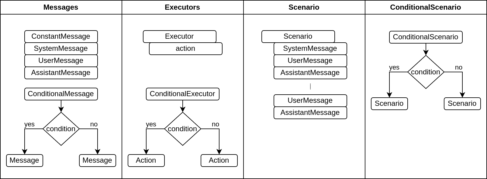

# 🤖 RAI

**RAI** is a framework for creating conversations between users and assistants in the [ROS2](https://ros.org/) ecosystem. It uses predefined, flexible scenarios with built-in actions. The engine is designed to be adaptable and scalable, supporting a wide range of nodes across different domains.

## Planned demos 👀

- [🌾 agriculture demo](https://github.com/RobotecAI/rai-agriculture-demo)
- [🤖 husarion demo](https://github.com/RobotecAI/rai-husarion-demo)
- [🦾 manipulation demo](https://github.com/RobotecAI/rai-manipulation-demo)

## Table of Contents

- [Scenario Definition](#-scenario-definition)
  - [Scenario Building Blocks](#-scenario-building-blocks)
  - [Scenario Definition Example](#-scenario-definition-example)
- [Available LLM Vendors](#-available-llm-vendors)
  - [Vendors Initialization Examples](#-vendors-initialization-examples)
    - [Ollama](#ollama)
    - [OpenAI](#openai)
    - [AWS Bedrock](#aws-bedrock)
- [Integration with Robotic Systems](#-integration-with-robotic-systems)
- [Installation](#installation-instructions)
- [Further documentation](#further-documentation)

## General Architecture Diagram with Current and Planned Features


## 🧩 Scenario Definition

A scenario is a programmatically defined sequence of interactions between a User and an Assistant (LLM). Each scenario consists of multiple components that dictate the flow of conversation and actions.

### 🏗️ Scenario Building Blocks

Scenarios can be built using the following elements:

- **Messages**: Static or dynamic content communicated to the user.
- **Conditional Messages**: Content that changes based on certain conditions.
- **Executors**: Actions that the system can execute.
- **Conditional Executors**: Actions that are executed based on specific conditions.



For more about scenario building see: [docs/scenarios.md](docs/scenarios.md)\
For more about scenario running: [src/rai/scenario_engine](src/rai/scenario_engine)

#### For available messages see:

- 📬 [Messages](./src/rai/message.py)

#### For available actions see:

- 🔨 [Actions](./src/rai/actions/actions.py)
- 🤖 [ROS2 Actions](./src/rai/actions/ros_actions.py)

#### 📝 Scenario Definition Example

For example scenarios see:

- 📘 [Simple scenario with email communication](./examples/demo_example.py)
- 🤖 [ROS2 scenario](./examples/agri_ros_example.py)
- 🔄 [Conditional messages and executors scenario](./examples/agri_example.py)

## 🌐 Available LLM Vendors

We currently support the following vendors:

Locally hosted:

- 🏠 Ollama [link](https://ollama.com/)

Cloud hosted:

- ☁️ AWS Bedrock [link](https://aws.amazon.com/bedrock/)
- ☁️ OpenAI [link](https://platform.openai.com/)

Planned:

- ☁️ Anthropic [link](https://www.anthropic.com/api)
- ☁️ Cohere [link](https://cohere.com/)

For more see: [src/rai/vendors](src/rai/vendors)

### 🚀 Vendors Initialization Examples

#### Ollama

```python
OllamaVendor(
    ip_address="ip address",
    port="11434",
    model="llava",
    logging_level=logging.INFO,
)
```

#### OpenAI

```python
open_ai_vendor = OpenAIVendor(
    model="gpt-4o", stream=False, logging_level=logging.INFO
)
```

#### AWS Bedrock

```python
AWSBedrockVendor(
    model="anthropic.claude-3-opus-20240229-v1:0", logging_level=logging.INFO
)
```

## 🔗 Integration with Robotic Systems

This engine provides support for integration with robotic systems through ROS2, allowing for real-time control and feedback within various robotic applications.\
For more information see: [src/rai/communication](src/rai/communication)

## 📚 Installation and further documentation

### Installation instructions

#### Requirements

- python3.10^
- poetry

Poetry installation (probably other versions will work too):

```bash
python3 -m pip install poetry==1.8.3
```

#### Installation

1. Clone the repository:

```sh
git clone https://github.com/RobotecAI/rai.git
cd rai
```

2. Create and activate a virtual environment:

```sh
poetry install
poetry shell
```

### Further documentation

For examples see [examples](examples/)\
For Message definition: [messages.md](docs/messages.md)\
For Scenario definition: [scenarios.md](docs/scenarios.md)

For more information see readmes in respective folders.

```
.
├── docs
│   ├── messages.md
│   └── scenarios.md
├── README.md
└── src
    └── rai
        ├── actions
        │   └── README.md
        ├── communication
        │   └── README.md
        ├── README.md
        ├── scenario_engine
        │   └── README.md
        └── vendors
            └── README.md
```
