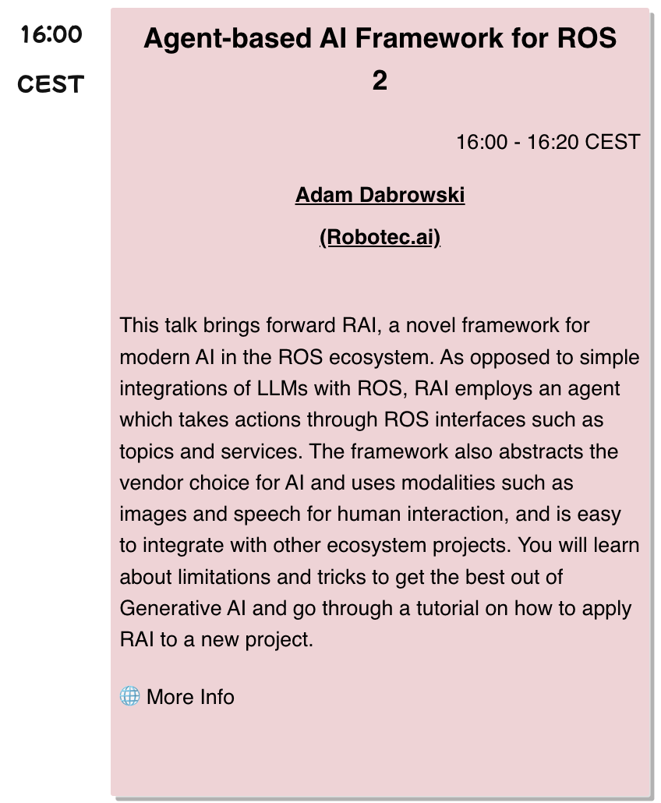

# RAI

> [!IMPORTANT]  
> **RAI is in beta phase now, expect friction. Early contributors are the most welcome!** \
> **RAI is developing fast towards a glorious release in time for ROSCon 2024.**

RAI is a flexible AI agent framework to develop and deploy Gen AI features for your robots.

---

<div align="center">


---

[](https://opensource.org/licenses/Apache-2.0)


[](https://discord.gg/GZGfejUSjt)

</div>

---

## Overview

The RAI framework aims to:

- Supply a general multi-agent system, bringing Gen AI features to your robots.
- Add human interactivity, flexibility in problem-solving, and out-of-box AI features to existing robot stacks.
- Provide first-class support for multi-modalities, enabling interaction with various data types.
- Incorporate an advanced database for persistent agent memory.
- Include ROS 2-oriented tooling for agents.
- Support a comprehensive task/mission orchestrator.

## Table of Contents

- [Features](#features)
- [Setup](#setup)
- [Usage examples (demos)](#planned-demos)
- [Developer resources](#developer-resources)
- [ROSCon 2024 Talk](#roscon-2024)

## Features

- [x] Voice interaction (both ways).
- [x] Customizable robot identity, including constitution (ethical code) and documentation (understanding own capabilities).
- [x] Accessing camera ("What do you see?") sensor, utilizing VLMs.
- [x] Reasoning about its own state through ROS logs.
- [x] ROS 2 action calling and other interfaces. The Agent can dynamically list interfaces, check their message type, and publish.
- [x] Integration with LangChain to abstract vendors and access convenient AI tools.
- [x] Tasks in natural language to nav2 goals.
- [x] NoMaD integration.
- [x] Tracing.
- [ ] Grounded SAM 2 integration.
- [ ] Improved Human-Robot Interaction with voice and text.
- [ ] SDK for RAI developers.
- [ ] Support for at least 3 different AI vendors.
- [ ] Additional tooling such as GroundingDino.
- [ ] UI for configuration to select features and tools relevant for your deployment.

## Setup

### 1. Setting up the workspace:

#### 1.1 Install poetry

RAI uses [Poetry](https://python-poetry.org/) for python packaging and dependency management. Install poetry (1.8+) with the following line:

```bash
curl -sSL https://install.python-poetry.org | python3 -
```

Alternatively, you can opt to do so by following the [official docs](https://python-poetry.org/docs/#installation).

#### 1.2 Clone the repository:

```bash
git clone https://github.com/RobotecAI/rai.git
cd rai
```

#### 1.3 Create poetry virtual environment and install dependencies:

```bash
poetry install
rosdep install --from-paths src --ignore-src -r -y
```

### 2. Build the project:

#### 2.1 Build RAI workspace

```bash
colcon build --symlink-install
```

#### 2.2 Activate a virtual environment:

```bash
source ./setup_shell.sh
```

### 3. Setting up vendors

RAI is vendor-agnostic. Use the configuration in [config.toml](./config.toml) to set up your vendor of choice for RAI modules.
Vendor choices for RAI and our recommendations are summarized in [Vendors Overview](docs/vendors_overview.md).

> We strongly recommend you to use of best-performing AI models to get the most out of RAI!

Pick your local solution or service provider and follow one of these guides:

- **[Ollama](https://ollama.com/download)**
- **[OpenAI](https://platform.openai.com/docs/quickstart)**
- **[AWS Bedrock](https://console.aws.amazon.com/bedrock/home?#/overview)**

## Running RAI

You are now ready to run RAI!


You can start by running the following examples:

1. **Hello RAI:** Interact directly with your ROS 2 environment through an intuitive Streamlit chat interface.
2. **O3DE Husarion ROSbot XL demo"** give tasks to a simulated robot using natural language.

### Hello RAI

Chat seamlessly with your ROS 2 environment, retrieve images from cameras, adjust parameters, and get information about your ROS interfaces.

```bash
streamlit run src/rai_hmi/rai_hmi/text_hmi.py
```

Remember to run this command in a sourced shell.

### O3DE Rosbot XL Demo

This demo provides a practical way to interact with and control a virtual Husarion ROSbot XL within a simulated environment.
Using natural language commands, you can assign tasks to the robot, allowing it to perform a variety of actions.

Given that this is a beta release, consider this demo as an opportunity to explore the framework's capabilities, provide feedback, and contribute.
Try different commands, see how the robot responds, and use this experience to understand the potential and limitations of the system.

Follow this guide: [husarion-rosbot-xl-demo](docs/demos.md)

## What's next?

Once you know your way around RAI, try the following challenges, with the aid the [developer guide](developer_guide.md):

- Run RAI on your own robot and talk to it, asking questions about what is in its documentation (and others!).
- Implement additional tools and use them in your interaction.
- Try a complex, multi-step task for your robot, such as going to several points to perform observations!

Soon you will have an opportunity to work with new RAI demos across several domains.

### Planned demos

| Application                                | Robot                          | Description                                                                                                                                      | Link                                                          |
| ------------------------------------------ | ------------------------------ | ------------------------------------------------------------------------------------------------------------------------------------------------ | ------------------------------------------------------------- |
| Mission and obstacle reasoning in orchards | Autonomous tractor             | In a beautiful scene of a virtual orchard, RAI goes beyond obstacle detection to analyze best course of action for a given unexpected situation. | [🌾 demo](https://github.com/RobotecAI/rai-agriculture-demo)  |
| Manipulation tasks with natural language   | Robot Arm (Franka Panda)       | Complete flexible manipulation tasks thanks to RAI and Grounded SAM 2                                                                            | [🦾 demo](https://github.com/RobotecAI/rai-manipulation-demo) |
| Quadruped inspection demo                  | A robot dog (ANYbotics ANYmal) | Perform inspection in a warehouse environment, find and report anomalies                                                                         | link TBD                                                      |

## Community

### RAI Q&A

Please take a look at [Q&A](https://github.com/RobotecAI/rai/discussions/categories/q-a).

### Developer Resources

See our [Developer Guide](docs/developer_guide.md) for a deeper dive into RAI, including instructions on creating a configuration specifically for your robot.

### Contributing

You are welcome to contribute to RAI! Please see our [Contribution Guide](CONTRIBUTING.md).

### RAI release and talk

RAI will be released on **October 15th**, right before [ROSCon 2024](https://roscon.ros.org/2024/).
If you are going to the conference, come join us at RAI talk on October 23rd.

<p align="center">

</p>
