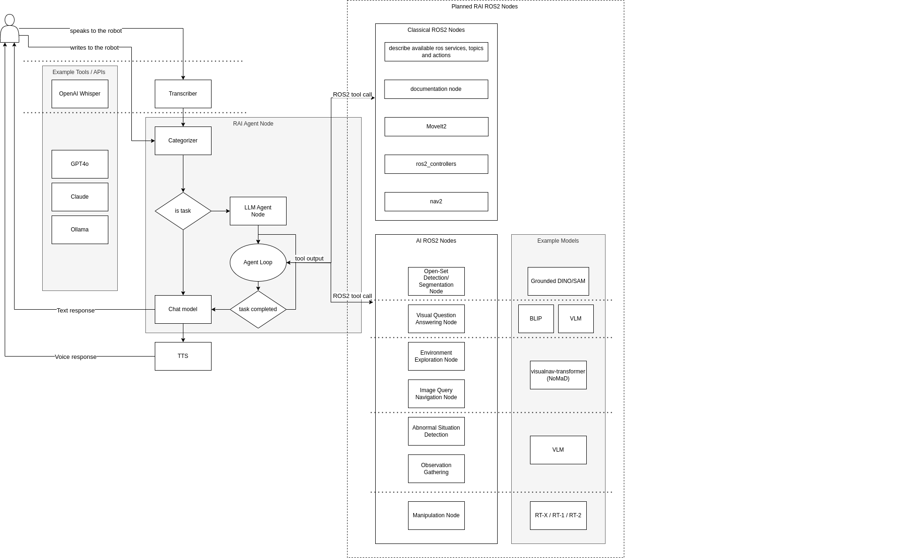

# 🦊 RAI

Welcome to the RAI Framework repository! We are dedicated to advancing robotics by integrating Generative AI to enable intelligent task fulfillment and enhance conventional algorithms.

## Overview

The RAI framework aims to:

- Advance robotics through the integration of GenAI.
- Enable intelligent task fulfillment.
- Enhance conventional algorithms.
- Develop a sophisticated multiagent system.
- Incorporate an advanced database for persistent agent memory.
- Create sophisticated ROS 2-oriented tooling for agents.
- Build a comprehensive task/mission orchestrator.

# Table of Contents

- [Quick Start](#installation)
- [Usage examples (demos)](#planned-demos)
- [Available vendors](#available-llm-vendors)
- [Documentation](#scenario-definition)
- [Integration with Robotic Systems](#integration-with-robotic-systems)
- [Further documentation](#further-documentation)

## General Architecture Diagram with Current and Planned Features



## Scenario Definition

A scenario is a programmatically defined sequence of interactions between a User and an Assistant (LLM). Each scenario consists of multiple components that dictate the flow of conversation and actions.

### Scenario Building Blocks

Scenarios can be built using the following elements:

- **Messages**: Static or dynamic content communicated to the user.
- **Conditional Scenarios**: Content that changes based on certain conditions.

For more about scenario building see: [docs/scenarios.md](docs/scenarios.md)\
For more about scenario running: [src/rai/scenario_engine/README.md](src/rai/scenario_engine/README.md)

#### For available tools see:

- [Tools](./src/rai/tools/)
- [ROS 2 Tools](./src/rai/tools/ros/)

#### Scenario Definition Example

For example scenarios see:

- [ROS 2 scenario](./examples/husarion_poc_example.py)
- [Simple scenario](./examples/agri_example.py)

## Available LLM Vendors

We currently support the following vendors:

| Vendor                                         | Host Type      | Supported | Tool Calling | Multimodal |
| ---------------------------------------------- | -------------- | --------- | ------------ | ---------- |
| [Ollama](https://ollama.com/)                  | Locally hosted | ✔️        | ❌           | ❌         |
| [AWS Bedrock](https://aws.amazon.com/bedrock/) | Cloud hosted   | ✔️        | ✔️           | ✔️         |
| [OpenAI](https://platform.openai.com/)         | Cloud hosted   | ✔️        | ✔️           | ✔️         |
| [Anthropic](https://www.anthropic.com/api)     | Cloud hosted   | ⏳        | ⏳           | ⏳         |
| [Cohere](https://cohere.com/)                  | Cloud hosted   | ⏳        | ⏳           | ⏳         |

For more see: [docs/vendors.md](./docs/vendors.md)

## Integration with Robotic Systems

This engine provides support for integration with robotic systems through ROS 2, allowing for real-time control and feedback within various robotic applications.\
For more information see: [src/rai/communication/README.md](./src/rai/communication/README.md)

# Installation

## Prerequisites

- python3.10 or python3.12
- poetry
- ROS 2 humble or ROS 2 jazzy
- tf-transformations package

### 0. Packages installation:

```bash
python3 -m pip install poetry
export PATH="$HOME/.local/bin:$PATH"
```

```
sudo apt install ros-${ROS_DISTRO}-tf-transformations
```

### 1. Clone the repository:

```bash
git clone git@github.com:RobotecAI/rai-private.git
cd rai-private
```

### 2. Create poetry virtual environment and install dependencies:

```sh
poetry install
rosdep install --from-paths src --ignore-src -r -y
```

### 2. Build ros project:

```bash
. /opt/ros/${ROS_DISTRO}/setup.bash
colcon build --symlink-install
```

### 2. Activate a virtual environment:

```bash
. /opt/ros/${ROS_DISTRO}/setup.bash
. ./install/setup.bash
poetry shell
```

### 3. Setup vendor keys (for paid vendors)

#### OpenAI

If you do not have a key, see how to generate one [here](https://platform.openai.com/docs/quickstart).

```
export OPENAI_API_KEY=""
```

#### AWS Bedrock

If you do not have the keys, see how to generate them [here](https://docs.aws.amazon.com/bedrock/latest/userguide/setting-up.html)

```
export AWS_ACCESS_KEY_ID=""
export AWS_SECRET_ACCESS_KEY=""
export AWS_SESSION_TOKEN=""
```

## Installation verification (optional)

### 1. Set up vendor keys

### 2. Run pytest

```bash
pytest -m billable
```

> [!WARNING]
> Running the tests will trigger paid api calls.

### 3. Run example

This example mocks the interaction with [rai-agriculture-demo](https://github.com/RobotecAI/rai-agriculture-demo) by using static images and skipping ROS 2 communication. The full integration is planned in future releases.

```bash
python examples/agri_example.py --vendor openai
```

Expected outcome:

```
$ python examples/agri_example.py
2024-06-28 12:33:09 robo-pc-054 ScenarioRunner[2593946] INFO Starting conversation.
2024-06-28 12:33:09 robo-pc-054 langfuse[2593946] WARNING Item exceeds size limit (size: 4703784), dropping input/output of item.
2024-06-28 12:33:09 robo-pc-054 langfuse[2593946] WARNING Item exceeds size limit (size: 4703871), dropping input/output of item.
Running tool: StopTool with args: {}
Running tool: UseHonkTool with args: {}
2024-06-28 12:33:24 robo-pc-054 langfuse[2593946] WARNING Item exceeds size limit (size: 8150030), dropping input/output of item.
2024-06-28 12:33:24 robo-pc-054 langfuse[2593946] WARNING Item exceeds size limit (size: 8150117), dropping input/output of item.
Running tool: ContinueActionTool with args: {}
2024-06-28 12:33:43 robo-pc-054 ScenarioRunner[2593946] INFO Conversation completed.
2024-06-28 12:33:43 robo-pc-054 ScenarioRunner[2593946] INFO Conversation saved to: logs/ChatOpenAIxxxx-xx-xx_xx:xx:xx.xxxxxx/history.html
```

## Maximizing RAI potential

Some of the modules or examples may require langfuse api keys for usage tracking. Contact repo maintainers for api keys.

```bash
export LANGFUSE_PK="pk-lf-*****"
export LANGFUSE_SK="sk-lf-****"
export LANGFUSE_HOST=""
```

# Planned demos

- [agriculture demo 🌾](https://github.com/RobotecAI/rai-agriculture-demo)
- [husarion demo 🤖](https://github.com/RobotecAI/rai-husarion-demo)
- [manipulation demo 🦾](https://github.com/RobotecAI/rai-manipulation-demo)

# Further documentation

For examples see [examples](./examples/README.md)\
For Message definition: [messages.md](docs/messages.md)\
For Scenario definition: [scenarios.md](docs/scenarios.md)

For more information see readmes in respective folders.

```
.
├── docs
│   ├── messages.md
│   └── scenarios.md
├── README.md
└── src
    └── rai
        ├── tools
        │   └── README.md
        ├── communication
        │   └── README.md
        ├── README.md
        └── scenario_engine
            └── README.md
```
