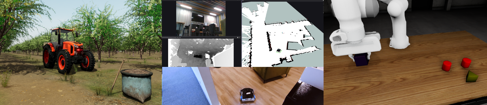
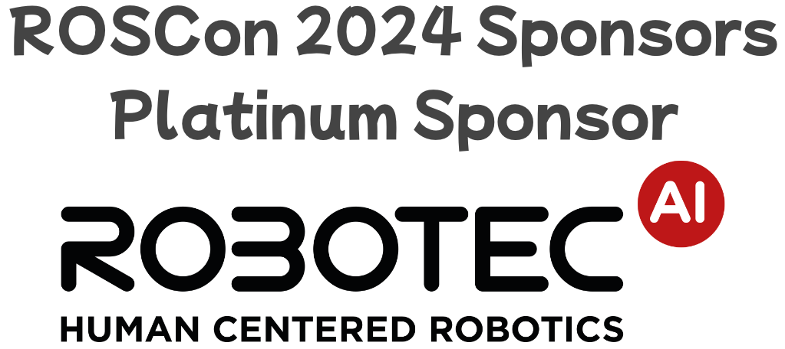
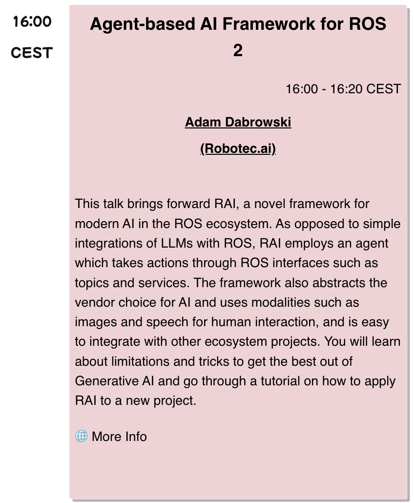

# RAI

**RAI** is a framework designed to enhance the functionality of robots through the use of GenAI. RAI employs an agent-based architecture that interacts using [ROS 2](https://ros.org/) interfaces, including topics, services, and actions. We support agent-based reasoning (offering maximum flexibility) as well as structured reasoning (providing greater reliability but less flexibility).

RAI is vendor-agnostic by design, making it compatible with AWS Bedrock, OpenAI, Anthropic, Cohere, as well as locally hosted solutions like Ollama or vllm.

## Diverse Tooling

As RAI interacts with the environment via ROS 2 messages, much of the tooling is implemented as a ROS 2 packages that can be used within RAI's AI pipeline or as standalone packages.

Given that RAI is a domain-agnostic framework, we are developing a diverse suite of tools using various state-of-the-art AI models, such as Grounding Dino, Grounding Sam, NoMaD, OpenVLA, Whisper, and more.

To make RAI easily integrable with your system, we are working on a seamless integration with Nav2 and MoveIt 2 stacks.

For more information, see the packages inside ./src directory. If there is a tool you would like to see in RAI, feel free to drop an issue or contact us via LinkedIn.

## Adjusting RAI for your needs

RAI can be used in various ways:

- Mission supervisor\
Employ genAI as a supervisor & reporter for high quality mission logs.

- Solver for unexpected situations\
Use genAI in order to address situations that are not handled well conventionally, typically because they require reasoning.

- Embodied agent\
Embodied AI with full flexibility, interacting with humans and other systems.

# ROSCon 2024

RAI will be released before [ROSCon 2024](https://roscon.ros.org/2024/)!

## RAI Talk

RAI will be presented as a talk at [ROSCon 2024](https://roscon.ros.org/2024/), make sure to participate!

## Planned Demos 👀

We are planning a number of demos showcasing RAI's use cases in various environments and domains.

- [🌾 Agriculture Demo](https://github.com/RobotecAI/rai-agriculture-demo)
- [🤖 Husarion Demo](https://github.com/RobotecAI/rai-husarion-demo)
- [🦾 Manipulation Demo](https://github.com/RobotecAI/rai-manipulation-demo)

The list will likely be extended, stay tuned!

---

For any inquires about RAI feel free to contact us on [LinkedIn](https://www.linkedin.com/company/robotec-ai) or visit us on [Robotec.ai](https://robotec.ai/)!
