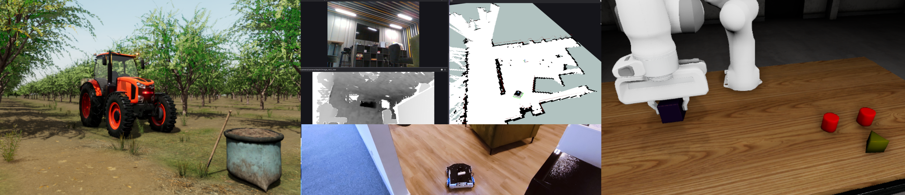

# RAI

> [!IMPORTANT]  
> **RAI is currently a work in progress. We are consistently developing the framework, aiming for stabilization in time for ROSCon 2024.**



Welcome to the RAI Framework repository! We are dedicated to advancing robotics by integrating Generative AI to enable intelligent task fulfillment and enhance conventional algorithms.

## Overview

The RAI framework aims to:

- Advance robotics through the integration of GenAI.
- Enable intelligent task fulfillment.
- Enhance conventional algorithms.
- Develop a general multiagent system.
- Provide first-class support for multimodalities, enabling interaction with various data types.
- Incorporate an advanced database for persistent agent memory.
- Create sophisticated ROS 2-oriented tooling for agents.
- Build a comprehensive task/mission orchestrator.

# Table of Contents

- [Quick Start](#installation)
- [Usage examples (demos)](#planned-demos)
- [Further documentation](#further-documentation)

# Quick Start

Currently, RAI supports Ubuntu 24.04 with ROS 2 Jazzy and Python 3.12, but it should also work on a Humble stack.

### 1. Setting up the workspace:

#### 1.1 Install poetry

Install poetry (1.8+) with the following line, or

```bash
curl -sSL https://install.python-poetry.org | python3 -
```

by following the official [docs](https://python-poetry.org/docs/#installation)

#### 1.2 Clone the repository:

```bash
git clone https://github.com/RobotecAI/rai.git
cd rai
```

#### 1.3 Create poetry virtual environment and install dependencies:

```bash
poetry install
rosdep install --from-paths src --ignore-src -r -y
```

### 2. Build the project:

#### 2.1 Build ros project

```bash
source /opt/ros/${ROS_DISTRO}/setup.bash
colcon build --symlink-install
```

#### 2.2 Activate a virtual environment:

```bash
source ./setup_shell.sh
```

### 3. Setting up vendors

While RAI strives to be fully vendor-agnostic, most of the development work currently utilizes OpenAI models. Setting the `OPENAI_API_KEY` environment variable will yield the best results.

#### OpenAI

If you do not have a key, see how to generate one [here](https://platform.openai.com/docs/quickstart).

```
export OPENAI_API_KEY=""
```

#### Congratulations, your installation is now complete! You're just moments away from diving into your first RAI (beta) experience.

# Running RAI

RAI is a sophisticated framework targetted at solving near general cases. As of now, we provide the following examples:

1. Engage with your ROS 2 network through our intuitive Streamlit chat interface.
2. Explore the O3DE Rosbot XL demo and assign tasks via natural language.

But why stop there? If you’re up for a challenge and ready to push the boundaries:

- Create your own robot description package and unleash it with the rai_whoami node.
- Run Streamlit powered by your custom robot’s description package and effortlessly acces your robot's documentation as well as identity and constitution.
- Implement additional tools via langchain's @tool and use them in your chat.

## 1. Chat Interface

Chat seamlessly with your setup, retrieve images from cameras, adjust parameters on the fly, and get comprehensive information about your topics.

```bash
streamlit run src/rai_hmi/rai_hmi/streamlit_hmi_node.py
```

Remember to run this command in a sourced shell.

## 2. O3DE Rosbot XL Demo

This demo provides a practical way to interact with and control a virtual Rosbot XL within a simulated environment. Using natural language commands, you can assign tasks to the robot, allowing it to perform a variety of actions.

Given that this is a beta release, consider this demo as an opportunity to explore the framework's capabilities and provide feedback. Try different commands, see how the robot responds, and use this experience to understand the potential and limitations of the system.

For running information see: [husarion-demo](./docs/demos.md)

# Planned demos

- [agriculture demo 🌾](https://github.com/RobotecAI/rai-agriculture-demo)
- [husarion demo 🤖](https://github.com/RobotecAI/rai-husarion-demo)
- [manipulation demo 🦾](https://github.com/RobotecAI/rai-manipulation-demo)

# Further documentation

For examples see [examples](./examples/README.md)\
For Multimodal Messages definition: [multimodal messages](docs/multimodal_messages.md)\
For available ROS2 packages: [ros packages](docs/ros_-_packages.md)

For more information see readmes in respective folders.
