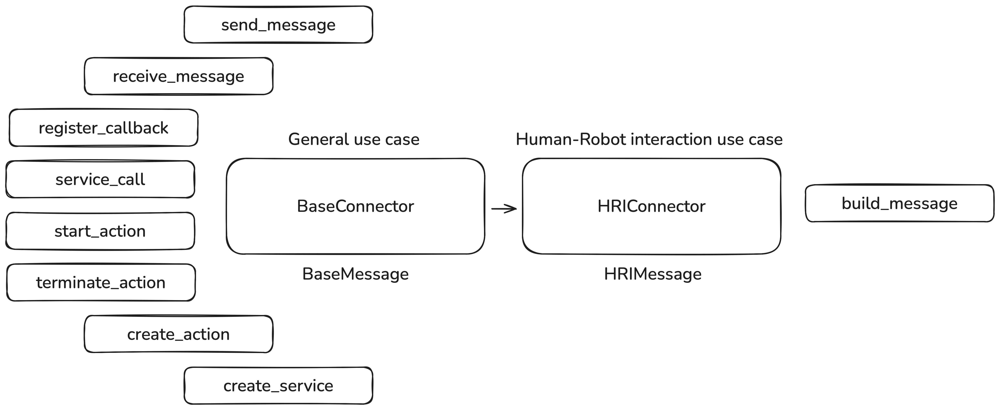

# Connectors

Connectors are a set of abstract interfaces and implementations designed to provide a unified way to
interact with various communication systems, including robot middleware like ROS2, sound devices,
and other I/O systems.

## Connector Architecture

The connector architecture is built on a hierarchy of abstract base classes and concrete
implementations:

### Base Classes

#### BaseConnector[T]

??? info "BaseConnector class definition"

    ::: rai.communication.base_connector.BaseConnector

The foundation interface that defines common communication patterns:

-   Message passing (publish/subscribe)
-   Service calls (request/response)
-   Actions (long-running operations with feedback)
-   Callback registration for asynchronous notifications

#### HRIConnector[T]

??? info "HRIConnector class definition"

    ::: rai.communication.hri_connector.HRIConnector

Extends BaseConnector with Human-Robot Interaction capabilities:

-   Supports multimodal messages (text, images, audio)
-   Provides conversion to/from Langchain message formats
-   Handles message sequencing and conversation IDs

### Concrete Implementations

| Connector              | Description                            | Documentation Link                         |
| ---------------------- | -------------------------------------- | ------------------------------------------ |
| ROS 2 Connectors       | Robot Operating System 2 integration   | [ROS2 Connectors](./ROS_2_Connectors.md)   |
| Sound Device Connector | Audio streaming and playback/recording | [Sound Device Connector](./sounddevice.md) |

## Key Features

### Message Types

Connectors are generic over message types derived from BaseMessage:

-   **BaseMessage**: Foundation message type with payload and metadata
-   **ROS2Message**: Message type for ROS 2 communication
-   **HRIMessage**: Multimodal message type with text, images, and audio
-   **ROS2HRIMessage**: HRIMessage specialized for ROS 2 transport
-   **SoundDeviceMessage**: Specialized message for audio operations

### Communication Patterns

Connectors support multiple communication patterns:

1.  **Publish/Subscribe**

    -   `send_message(message, target, **kwargs)`: Send a message to a target
    -   `receive_message(source, timeout_sec, **kwargs)`: Receive a message from a source
    -   `register_callback(source, callback, **kwargs)`: Register for asynchronous notifications

2.  **Request/Response**

    -   `service_call(message, target, timeout_sec, **kwargs)`: Make a synchronous service call

3.  **Actions**

    -   `start_action(action_data, target, on_feedback, on_done, timeout_sec, **kwargs)`: Start a
        long-running action
    -   `terminate_action(action_handle, **kwargs)`: Cancel an ongoing action
    -   `create_action(action_name, generate_feedback_callback, **kwargs)`: Create an action server

## Threading Model

Connectors implement thread-safe operations:

-   ROS 2 connectors use a dedicated thread with MultiThreadedExecutor
-   Callbacks are executed in a ThreadPoolExecutor for concurrent processing
-   Proper synchronization for shared resources
-   Clean shutdown handling for all resources

## Usage Examples

| Connector    | Example Usage Documentation                              |
| ------------ | -------------------------------------------------------- |
| ROS 2        | [ROS2 Connectors](./ROS_2_Connectors.md#example-usage)   |
| Sound Device | [Sound Device Connector](./sounddevice.md#example-usage) |

## Error Handling

Connectors implement robust error handling:

-   All operations have appropriate timeout parameters
-   Exceptions are properly propagated and documented
-   Callbacks are executed in a protected manner to prevent crashes
-   Resources are properly cleaned up during shutdown

## See Also

-   [Agents](../agents/overview.md): For more information on the different types of agents in RAI
-   [Aggregators](../aggregators/overview.md): For more information on the different types of aggregators in RAI
-   [Langchain Integration](../langchain_integration/overview.md): For more information on the different types of connectors in RAI
-   [Multimodal messages](../langchain_integration/multimodal_messages.md): For more information on the different types of connectors in RAI
-   [Runners](../runners/overview.md): For more information on the different types of runners in RAI
