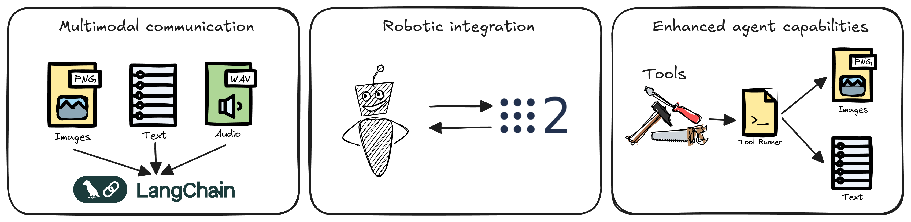

# Langchain Integration

## Introduction

RAI leverages Langchain to bridge the gap between large language models and robotic systems. This integration enables natural language understanding, complex reasoning, and multimodal interactions in robotic applications.

## Why Langchain?

Langchain provides a robust foundation for building AI applications with several key advantages:

1. **Standardized Interfaces**

   - Consistent API across different LLM providers
   - Simplified model switching and comparison
   - Reduced vendor lock-in

2. **Rich Tool Ecosystem**

   - Pre-built components for common tasks
   - Extensible tool framework
   - Integration with external systems

3. **Advanced Capabilities**
   - Memory and context management
   - Agent-based reasoning
   - Retrieval-augmented generation

## RAI's Extension of Langchain



RAI extends Langchain's capabilities to meet the unique requirements of robotic systems:

1. **Multimodal Communication**

   - Rich media support (images, audio)
   - Real-time sensor data integration
   - Enhanced human-robot interaction

2. **Robotic Integration**

   - ROS 2 communication layer
   - ROS 2 toolset

3. **Enhanced Agent Capabilities**
   - Extended tool runners for robotic (multimodal) operations
   - Specialized agent types for robotic tasks
   - Integration with robotic perception systems

## Key Benefits

The integration of Langchain in RAI provides several strategic advantages:

1. **Flexibility**

   - Work with any Langchain-compatible LLM
   - Extend existing Langchain applications
   - Mix and match components as needed

2. **Robustness**

   - Battle-tested framework
   - Large community support
   - Regular updates and improvements

3. **Extensibility**
   - Easy to add new capabilities
   - Customizable components
   - Integration with existing systems

## Using Langchain in RAI

### Getting Started

```python
from rai import get_llm_model

# Initialize LLM configured in config.toml
llm = get_llm_model(model_type='complex_model')
```

### Common Patterns

1.  **Agent-Based Systems**

    ```python
    from rai.agents.langchain.runnables import create_react_runnable

    # Create an agent with tools
    agent = create_react_runnable(
        llm=llm,
        tools=[ros2_topic, get_image]
    )
    agent.invoke({"messages": [HumanMessage(content="Analyze this image")]})
    ```

2.  **Multimodal Communication**

    ```python
    from rai.messages import HumanMultimodalMessage, preprocess_image

    # Create a message with media
    message = HumanMultimodalMessage(
        content="Analyze this image",
        images=[preprocess_image(image_uri)]
    )
    ```

3.  **Tool Integration**

    3.1 Text tool

    ```python
    from langchain_core.tools import tool

    # Define a custom tool
    @tool
    def custom_operation(input: str) -> str:
        # Tool implementation
        return result
    ```

    3.2 Multimodal tool

    !!! important "Multimodal tools requirements"

        Multimodal tools must use RAI's custom ToolRunner which automatically handles multimodal output.
        For more information see [tools](../tutorials/tools.md)

    ```python
    from langchain_core.tools import tool
    from rai.messages import MultimodalArtifact

    @tool(response_format="content_and_artifact")
    def custom_operation(input: str) -> str:
        # Tool implementation
        return result, MultimodalArtifact(images=[base64_encoded_png_image])
    ```

    For extensive tooling guide see [tools](../tutorials/tools.md)

### Best Practices

1. **Message Handling**

   - Use appropriate message types
   - Handle media content carefully
   - Consider performance implications

2. **Tool Development**

   - Follow Langchain's tool patterns
   - Implement proper error handling
   - Document tool capabilities

3. **Agent Design**
   - Keep agents focused and specialized
   - Use appropriate tools for tasks
   - Consider real-time requirements

## When to Use Langchain in RAI

Langchain integration is particularly valuable in these scenarios:

1. **Complex AI Applications**

   - Multi-step reasoning
   - Tool usage
   - Memory and context management

2. **Flexible LLM Integration**

   - Support for multiple LLM providers
   - Easy switching between models
   - Custom model integration

3. **Robotic Intelligence**
   - Natural language interaction
   - Complex decision making
   - Multi-modal perception

## Limitations and Considerations

Understanding the limitations helps in making informed design decisions:

1. **Performance**

   - Consider latency in robotic applications
   - Handle large media content carefully
   - Optimize for real-time requirements

2. **Complexity**

   - Balance between flexibility and simplicity
   - Consider learning curve
   - Document custom extensions

3. **Integration**
   - Test thoroughly with robotic systems
   - Consider hardware limitations
   - Plan for error handling

## Future Directions

The integration continues to evolve with these focus areas:

1. **Enhanced Capabilities**

   - More specialized robotic tools
   - Improved media handling
   - Better real-time support

2. **Integration Improvements**

   - More robotic platforms
   - Additional sensor types
   - Enhanced perception systems

3. **Performance Optimizations**
   - Caching and optimization
   - Real-time improvements
   - Resource management

## Additional Resources

- [Langchain Documentation](https://python.langchain.com/docs/get_started/introduction)
- [Tooling Guide](../tutorials/tools.md)
