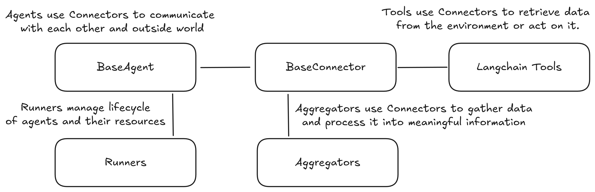

# RAI API Documentation

## Introduction

rai core provides a comprehensive set of tools and components for developing intelligent robotic systems powered by multimodal LLMs. This package bridges the gap between advanced AI capabilities and robotic platforms, enabling natural language understanding, reasoning, and multimodal interactions in robotic applications.

## Core Components

RAI consists of several key components that work together to create intelligent robotic systems:

| Component                              | Description                                                                                                               |
| -------------------------------------- | ------------------------------------------------------------------------------------------------------------------------- |
| [Agents](agents/overview.md)           | Agents are the central components that encapsulate specific functionalities and behaviors.                                |
| [Connectors](connectors/overview.md)   | Connectors provide a unified way to interact with various communication systems e.g., ROS 2.                              |
| [Aggregators](aggregators/overview.md) | Aggregators collect and process messages from various sources, transforming them into summarized or analyzed information. |
| [Runners](runners/overview.md)         | Manage the lifecycle of agents.                                                                                          |

On top of that, RAI implements two major integrations: ROS 2 and LangChain.

| Component                                                  | Description                                                                                                                                                  |
| ---------------------------------------------------------- | ------------------------------------------------------------------------------------------------------------------------------------------------------------ |
| [ROS 2 Integration](connectors/ROS_2_Connectors.md)        | RAI provides a set of tools to interact with ROS 2.                                                                                                          |
| [LangChain Integration](langchain_integration/overview.md) | RAI leverages LangChain to bridge the gap between large language models and robotic systems. RAI extends LangChain with seamless multimodal message support. |

## Getting Started

For practical examples and tutorials on using RAI, refer to the tutorials section. The API documentation provides detailed information about each component, its purpose, and usage patterns.

## Best Practices

When working with RAI:

1. Design agents with clear responsibilities and interfaces
2. Use appropriate connectors for your target platforms
3. Leverage aggregators to process complex sensor data
4. Follow established patterns for tool development
5. Consider performance implications for real-time robotic applications
