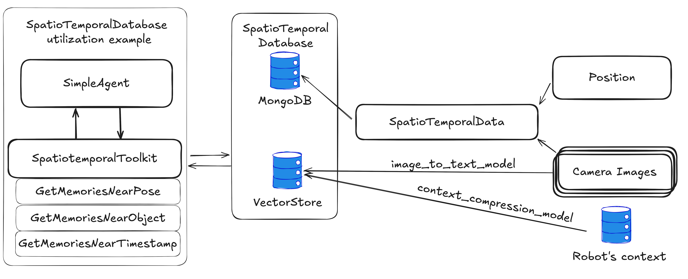

# SpatioTemporalAgent



## Overview

The `SpatioTemporalAgent` is an intelligent agent designed to capture, process, and store spatiotemporal data - information that combines both spatial (location, pose) and temporal (time-based) aspects. It's particularly useful in robotics and autonomous systems where understanding both the spatial context and its evolution over time is crucial.

Key capabilities:

- Captures and processes image data from multiple sources
- Records spatial transformations (e.g., robot poses)
- Converts visual data into textual descriptions using LLMs
- Compresses robot's current history to create a temporal context
- Stores all data in MongoDB for persistence and retrieval

## Core Components

### Data Model

The agent works with several key data structures:

- `SpatioTemporalRecord`: The main data container that includes:
  - `timestamp`: When the data was captured
  - `images`: Dictionary of camera images (base64 encoded)
  - `tf`: Transform data (robot's pose)
  - `temporal_context`: Compressed history of messages
  - `image_text_descriptions`: LLM-generated descriptions of the images

### Configuration

The agent is configured through `SpatioTemporalConfig`:

- `db_url`: MongoDB connection URL
- `db_name`: Target database name
- `collection_name`: Collection for data storage
- `image_to_text_model`: AI model for image description
- `context_compression_model`: AI model for context compression
- `vector_db`: Vector store
- `time_interval`: Data collection frequency

## ROS2 Implementation

The ROS2-specific implementation (`ROS2SpatioTemporalAgent`) extends the base agent to work with ROS2 systems.

### Additional Configuration

`ROS2SpatioTemporalConfig` adds ROS2-specific parameters:

- `camera_topics`: List of ROS2 topics providing image data
- `robot_frame`: The robot's reference frame (e.g., "base_link")
- `world_frame`: The world reference frame (e.g., "world")

### Setup and Usage

1. **Prerequisites**

   First, ensure MongoDB is running. Using Docker is recommended:

   ```bash
   docker run -d --name rai-mongo -p 27017:27017 mongo
   ```

2. **Agent Configuration**

   ```python
   import rclpy
   from rai.agents.spatiotemporal import ROS2SpatioTemporalAgent, ROS2SpatioTemporalConfig
   from rai.utils.model_initialization import get_llm_model, get_vectorstore

   config = ROS2SpatioTemporalConfig(
      robot_frame="base_link",
      world_frame="world",
      db_url="mongodb://localhost:27017/",
      db_name="rai",
      collection_name="spatiotemporal_collection",
      image_to_text_model=get_llm_model("simple_model"),
      context_compression_model=get_llm_model("simple_model"),
      time_interval=10.0,
      camera_topics=["/camera/camera/color/image_raw"],
      vector_db=get_vectorstore(),
   )

   agent = ROS2SpatioTemporalAgent(config)
   ```

   A complete working example can be found in `examples/agents/spatiotemporal.py`.

3. **Running the Agent**

   ```python
   agent.run()
   ```

## Best Practices

1. **Camera Topics**: Choose camera topics that provide stable, consistent data streams
2. **Transform Frames**: Ensure your robot_frame and world_frame are valid and published
3. **Time Interval**: Set based on your application needs - shorter for high-frequency monitoring, longer for periodic snapshots

## Troubleshooting

Common issues and solutions:

1. **Missing Images**

   - Verify camera topics are publishing
   - Check topic names and message types

2. **Transform Errors**

   - Confirm both frames exist in the TF tree
   - Check for timing issues in transform lookups
   - Verify transform chain is complete

3. **Database Issues**
   - Ensure MongoDB is running and accessible
   - Check database credentials and permissions
   - Verify network connectivity to database server
