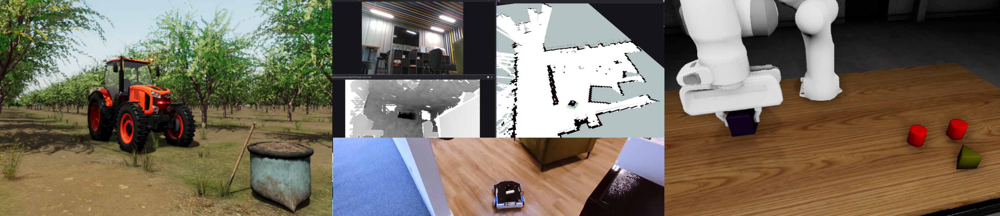

# Demos

RAI comes with a number of supported demos, which showcase different applications, but are by no means exhaustive.



## Installation

In the root directory of the `rai` repo, run the following command to fetch demo repositories:

```bash
vcs import < demos.repos
```

Once you have all the demos pulled, see dedicated docs to proceed:

- [Husarion ROSBot XL in an apartment](demos/rosbot_xl.md)
- Coming soon - autonomous tractor in an orchard.
- Coming soon - inspection with ANYmal robot dog.
- Coming soon - manipulation tasks demo
