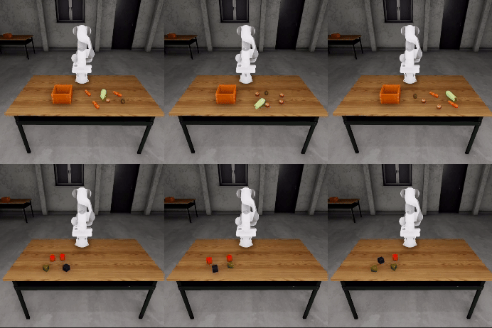

# Manipulation tasks with natural language

This demo showcases the capabilities of RAI in performing manipulation tasks using natural language
commands. The demo utilizes a robot arm (Franka Emika Panda) in a simulated environment,
demonstrating how RAI can interpret complex instructions and execute them using advanced vision and
manipulation techniques.



## Setup

> [!TIP] LLM model
>
> The demo uses the `complex_model` LLM configured in `config.toml`. The model should be a
> multimodal, tool-calling model. See [Vendors](../setup/vendors.md#llm-model-configuration-in-rai).

!!! tip "ROS 2 Sourced"

    Make sure ROS 2 is sourced. (e.g. `source /opt/ros/humble/setup.bash`)

1. Follow the RAI setup instructions in the [quick setup guide](../setup/install.md#setting-up-developer-environment).
2. Download additional dependencies:

    ```shell
    poetry install --with perception
    vcs import < demos.repos
    rosdep install --from-paths src/examples/rai-manipulation-demo/ros2_ws/src --ignore-src -r -y
    ```

3. Download the latest binary release

    ```bash
    ./scripts/download_demo.sh manipulation
    ```

4. Build the ROS 2 workspace:

    ```bash
    colcon build --symlink-install
    ```

## Running the Demo

!!! note "Remain in sourced shell"

    Ensure that every command is run in a sourced shell using `source setup_shell.sh`
    Ensure ROS 2 is sourced.

1. Start the demo

    ```shell
    ros2 launch examples/manipulation-demo.launch.py game_launcher:=demo_assets/manipulation/RAIManipulationDemo/RAIManipulationDemo.GameLauncher
    ```

2. In the second terminal, run the streamlit interface:

    ```shell
    streamlit run examples/manipulation-demo-streamlit.py
    ```

    Alternatively, you can run the simpler command-line version, which also serves as an example of
    how to use the RAI API for you own applications:

    ```shell
    python examples/manipulation-demo.py
    ```

3. Interact with the robot arm using natural language commands. For example:

    ```
    Enter a prompt: Pick up the red cube and drop it on another cube
    ```

!!! tip "Changing camera view"

    To change camera in the simulation use 1-7 keys on your keyboard once it's window is focused.

## How it works

The manipulation demo utilizes several components:

1. Vision processing using Grounded SAM 2 and Grounding DINO for object detection and segmentation.
2. RAI agent to process the request and plan the manipulation sequence.
3. Robot arm control for executing the planned movements.

The main logic of the demo is implemented in the `create_agent` function, which can be found in:

```python
examples/manipulation-demo.py
```

## Known Limitations

-   `Grounding DINO` can't distinguish colors.
-   VLMs tend to struggle with spatial understanding (for example left/right concepts).

!!! tip "Building from source"

    If you are having trouble running the binary, you can build it from source
    [here](https://github.com/RobotecAI/rai-manipulation-demo).
