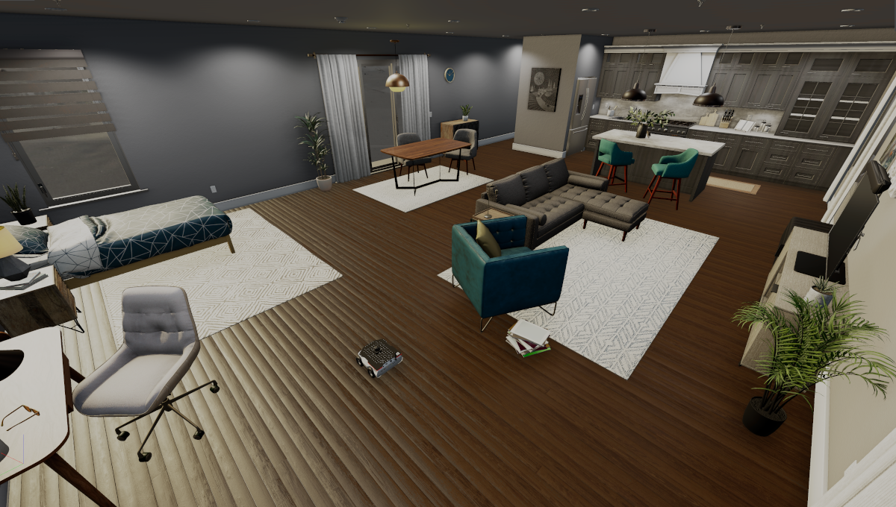

# Husarion Robot XL demo

This demo utilizes Open 3D Engine simulation and allows you to work with RAI on a small mobile platform in a nice apartment.



## Quick start

1. Download the newest binary release (`release.zip` file) from [rai-rosbot-xl-demo -> releases](https://github.com/RobotecAI/rai-rosbot-xl-demo/releases)
2. Install required packages

   ```bash
   sudo apt install ros-${ROS_DISTRO}-ackermann-msgs ros-${ROS_DISTRO}-gazebo-msgs ros-${ROS_DISTRO}-control-toolbox
   ```

3. Unpack the binary and run the simulation:

   ```bash
   unzip release.zip
   . /opt/ros/${ROS_DISTRO}/setup.bash
   ./release/RAIRosbotXLDemo.GameLauncher -bg_ConnectToAssetProcessor=0
   ```

4. Start navigation stack:
   ```bash
   ./src/examples/rai-rosbot-xl-demo/run-nav.sh
   ```

You are now ready to [run RAI](#running-rai)!

## Alternative: Demo source build

If you would like more freedom to adapt the simulation to your needs, you can make changes using
[O3DE Editor](https://www.docs.o3de.org/docs/welcome-guide/) and build the project
yourself.
Please refer to [rai husarion rosbot xl demo][rai rosbot demo] for more details.

# Running RAI

You can set the task for the agent in the `examples/nav2_example_ros_actions.py` file.

1. Prepare the robot description.

```bash
colcon build --symlink-install --packages-select rosbot_xl_whoami

. install/setup.bash
```

2. Start `rai_whoami_node`
   who_am_i node. It loads files from robot [description](https://github.com/RobotecAI/rai-rosbot-xl-demo/tree/development/src/rosbot_xl_whoami/description) folder to create robot identity.

```bash
source setup_shell.sh

ros2 run rai_whoami rai_whoami_node --ros-args -p robot_description_package:="rosbot_xl_whoami"
```

3. Start `rai_node`.

```bash
source setup_shell.sh

python examples/rosbot-xl-generic-node-demo.py
```

5. Play with the demo, adding tasks to the RAI agent. Here are some examples:

```bash
# Ask robot where it is. RAI will use camera to describe the environment
ros2 topic pub --once /task_addition_requests std_msgs/msg/String "data: 'Where are you now?'"

# See integration with the navigation stack
ros2 topic pub --once /task_addition_requests std_msgs/msg/String "data: 'Drive 1 meter forward'"
ros2 topic pub --once /task_addition_requests std_msgs/msg/String "data: 'Spin 90 degrees'"

# Try out more complicated tasks
ros2 topic pub --once /task_addition_requests std_msgs/msg/String "data: 'Drive forward if the path is clear, otherwise backward'"
```

> **NOTE**: For now agent is capable of performing only 1 task at once.
> Human-Robot Interaction module is not yet included in the demo (coming soon!).

### What is happening?

By looking at the example code in `src/examples/rosbot-xl-generic-node-demo.py` you can see that:

- This node has no information about the robot besides what it can get from `rai_whoami_node`.
- Topics can be whitelisted to only receive information about the robot.
- Before every LLM decision, `rai_node` sends its state to the LLM Agent. By default, it contains ros interfaces (topics, services, actions) and logs summary, but the state can be extended.
- In the example we are also adding description of the camera image to the state.

If you wish, you can learn more about [configuring RAI for a specific robot](../create_robots_whoami.md).

[rai rosbot demo]: https://github.com/RobotecAI/rai-rosbot-xl-demo
