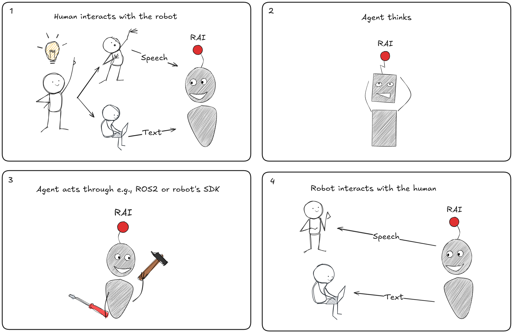

# RAI FAQ

??? tip "What is RAI and how does it work?"

    ??? question "What is RAI?"

        RAI is a flexible AI agent framework to develop and deploy Embodied AI features for your robots.

    ??? question "How does RAI work?"

        

        RAI connects human instructions to robot actions in four simple steps:

        -   Human gives a command: The user interacts with the robot using speech or text.
        -   RAI understands and reasons: RAI interprets the request, plans the response, and decides on the best action.
        -   RAI controls the robot: It sends commands to the robot through ROS 2 or the robot's SDK.
        -   Robot responds: The robot performs the action and can communicate back to the user, closing the loop.

    ??? question "Who is RAI for?"

        RAI is for robotics developers, researchers, educators, startups, companies, and hobbyists who want to add AI and natural language capabilities to robots, whether using ROS 2 or other robotics stacks. And anyone who’s ever looked at a robot and thought, “I wish you understood me.”

    ??? question "What can I do with RAI?"

        With RAI, you can control robots using voice or text, integrate vision, speech, and sensor data, build and test complex robot behaviors, use ready-made demos, develop multi-agent systems, create custom tools, implement real-time decision making, and design interactive scenarios for human-robot interaction. Or just teach your robot to bring you snacks. We don’t judge.

    ??? question "What demos are available for RAI?"

        RAI offers demos for [agricultural robotics](../demos/agriculture.md), [manipulation tasks](../demos/manipulation.md), [autonomous navigation with ROSbot XL](../demos/rosbot_xl.md), and [voice-controlled taxi scenarios](../demos/taxi.md). See the documentation for details on each demo.

        !!! info "Demos from ROSCon 2024"

            
<iframe src="https://player.vimeo.com/video/1023328281?h=1700a3cb57&amp;badge=0&amp;autopause=0&amp;player_id=0&amp;app_id=58479" frameborder="0" allow="autoplay; fullscreen; picture-in-picture; clipboard-write; encrypted-media" style="position:absolute;top:0;left:0;width:100%;height:100%;" title="RAI - Roscon &#039;24 reel demo"></iframe>

    ??? question "How do I build my own solution with RAI?"

        Follow the [step-by-step walkthrough](../tutorials/walkthrough.md) to deploy RAI on your robot, add custom tools and features, and create advanced multi-agent systems for complex tasks.

    ??? question "Does using RAI cost money?"

        RAI is free and open source software. However, if you use RAI with cloud-based models or third-party services, those may incur costs depending on the provider, model, and your usage. Please review the terms and pricing of any external services you choose to use with RAI.
        To use RAI cost-free, make sure to use local models and services.

??? tip "How can I get started with RAI?"

    ??? question "How do I install RAI?"

        Check out the [Quick Setup Guide](../setup/install.md) to install RAI, try a demo, or follow the walkthrough to build your own solution.

    ??? question "How do I try a demo?"

        Check out the [Quick Setup Guide](../setup/install.md) to install RAI, try a demo, or follow the walkthrough to build your own solution.

    ??? question "How do I build my own solution?"

        Follow the [step-by-step walkthrough](../tutorials/walkthrough.md) to deploy RAI on your robot, add custom tools and features, and create advanced multi-agent systems for complex tasks.

??? tip "How do I extend RAI?"

    ??? question "Missing a feature?"

        Start by checking our [API documentation](../API_documentation/overview.md) to see if the feature you need already exists. If not, you're welcome to open a new issue or contribute your own solution! The [step-by-step walkthrough](../tutorials/walkthrough.md) is a great way to get familiar with RAI's structure. With these resources, you'll be well-equipped to add new features or customize RAI for your needs. If you have questions, don't hesitate to reach out to the community!

    ??? question "How do I integrate a new type of sensor?"

        Integration depends on what you want to achieve with your sensor data. If you'd like to use the data with an LLM or multimodal model, you'll need to write a small adapter that converts the sensor output into a format the model can understand (such as text or images). For other use cases, you can create a custom tool or agent that processes the sensor data as needed. If you need guidance, our community is happy to help—just ask on Discord or open a discussion!

        !!! note

            At the moment, RAI does not implement a module for converting sensor data into text or images. These conversions are done on the application level/user side.

??? tip "How do I contribute to RAI?"

    ??? question "Contributtion guide"

        To develop RAI, you just need to know how to run `pre-commit` (spoiler alert: just type `pre-commit`), and you’re basically a core developer. For anything more complicated (or if you like reading rules), see the [Contribution Guide](../faq/contributing/CONTRIBUTING.md).

    ??? question "Existing issues/bugs/something is missings"

        If you find an issue/bug/feature missing, please check the [existing issues](https://github.com/RobotecAI/rai/issues) and if it is not already reported, create a new one.

    ??? question "I would like to contribute, but I don't know what"

        If you would like to contribute, but don't know what to do, please join our [Discord](https://discord.gg/3PGHgTaJSB) and we will help you find something to work on. Alternatively, browse the [issues](https://github.com/RobotecAI/rai/issues) for inspiration.

    ??? question "I've never contributed to open source before, how do I start?"

        Welcome! We love helping newcomers get started with open source. The RAI community is friendly and supportive—no prior experience with RAI required. Check out our [Contribution Guide](../faq/contributing/CONTRIBUTING.md) for step-by-step instructions, and feel free to join our [Discord](https://discord.gg/3PGHgTaJSB) to ask questions or get guidance. We're here to help you every step of the way!

??? tip "How do I get support for RAI?"

    !!! question "Where can I learn more about RAI?"

        You can find support by joining our [Discord](https://discord.gg/3PGHgTaJSB), or visiting the [Embodied AI Community Group](https://github.com/ros-wg-embodied-ai). For talks and demos, see the ROSCon 2024 links in the documentation.

    !!! question "Where can I get support?"

        You can find support and more information in the [Contribution Guide](../faq/contributing/CONTRIBUTING.md), on the [Q&A forum](https://github.com/RobotecAI/rai/discussions/categories/q-a), [issues](https://github.com/RobotecAI/rai/issues), by joining our [Discord](https://discord.gg/3PGHgTaJSB), or visiting the [Embodied AI Community Group](https://github.com/ros-wg-embodied-ai). For talks and demos, see the ROSCon 2024 links in the documentation.

??? tip "What do I need to get started with RAI?"

    !!! question "What are the requirements?"

        -   ROS 2 Humble or Jazzy
        -   Python 3.10 or 3.12
        -   Ubuntu 22.04 or 24.04

    !!! question "How about a robot?"

        RAI is compatible with any robot that has a ROS 2 interface or exposes another type of interface. The important thing is that your robot must already have a robotic stack set up.
        RAI builds on top of your existing robotic stack, but does not include the stack itself.

    !!! question "Do I even need a robot?"

        No, you can also run the demos on your computer or in custom-made simulations. Or just pretend. We won’t tell.

??? tip "RAI outside of robotics"

    !!! question "Can I use RAI outside of robotics?"

        Yes, you can use RAI in non-robotic applications. RAI supports ROS 2, but is not limited to it.

    !!! question "How do I use RAI outside of robotics?"

        RAI is designed to be flexible. There are multiple abstractions, that make working with multimodal data, multi-agent system, various communication protocols easy.
        For more information see the [RAI API documentation](../API_documentation/overview.md)

??? tip "Is RAI limited to LLMs?"

    !!! question "Can I use models other than LLMs in RAI?"

        No, RAI is not limited to large language models. You can integrate any type of model—such as vision models, speech recognition, classical AI, or custom algorithms—into your RAI agents. The BaseAgent abstraction is designed to make it easy to plug in any form of "intelligence" or decision logic.

    !!! question "How do I use other models in RAI?"

        To use a different model, simply implement your logic within a custom agent using the BaseAgent abstraction. This allows you to connect vision, speech, or any other AI model to your robot or application.
        For more details and code examples, see the [RAI API documentation](../API_documentation/overview.md).

??? tip "Licensing & Commercial Use"

    !!! question "Can I use RAI commercially?"

        Yes, RAI is licensed under the [Apache 2.0 license](https://www.apache.org/licenses/LICENSE-2.0).

    !!! question "Are there any restrictions on commercial use?"

        No, RAI is licensed under the [Apache 2.0 license](https://www.apache.org/licenses/LICENSE-2.0), which allows for commercial use. Make sure to follow the license terms and give credits to the original authors.

??? tip "Security & Privacy"

    !!! question "How does RAI handle security and privacy?"

        RAI can use both local and cloud models. For maximum privacy, we recommend using the most performing local models.
        For cloud models, we recommend using tested and trusted providers.
