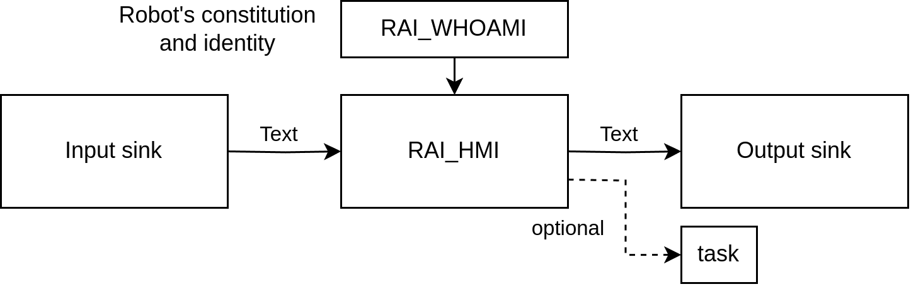
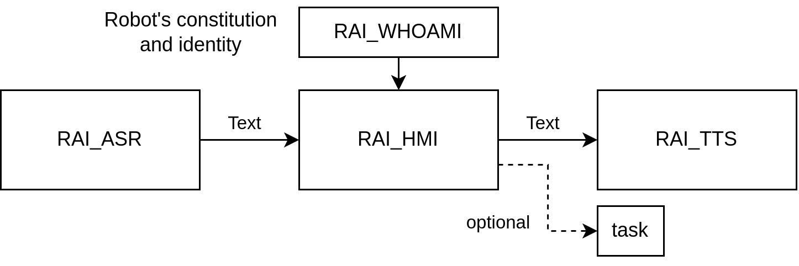
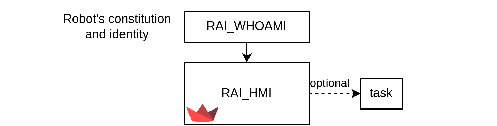

# RAI: Human-Robot Interaction

You can utilize RAI Human-Robot Interaction (HRI) package to converse with your robots.
This package allows you to simply chat with your robot, or to give it tasks and receive feedback and reports.
You have the following options:

- [Voice communication](human_robot_interface/voice_interface.md) using ASR and TTS models ([OpenAI Whisper](https://openai.com/index/whisper/))
- [Text communication](human_robot_interface/text_interface.md) using [Streamlit](https://streamlit.io)

If your environment is noisy, voice communication might be tricky.
In noisy environments, it is better to use text channel.

## How it works?

### General Architecture

The general architecture follows the diagram above. Text is captured from the input source, transported to the HMI, processed according to the given tools and robot's rules, and then sent to the output source.

### Voice Interface

In the voice interface, the input source is a microphone, while the output source is a speaker. The input is processed using the OpenAI [Whisper](https://platform.openai.com/docs/guides/speech-to-text/quickstart) model (cloud-based, paid), while the output can be produced using [OpenTTS](https://github.com/synesthesiam/opentts) (Apache-2.0, depending on the model used) or [ElevenLabs](https://github.com/elevenlabs/elevenlabs-python) (cloud-based, paid).

### Text Interface

The text interface is implemented directly in RAI_HMI using Streamlit. The GUI closely follows standard chat-like conversations, with built-in support for tool integration.
