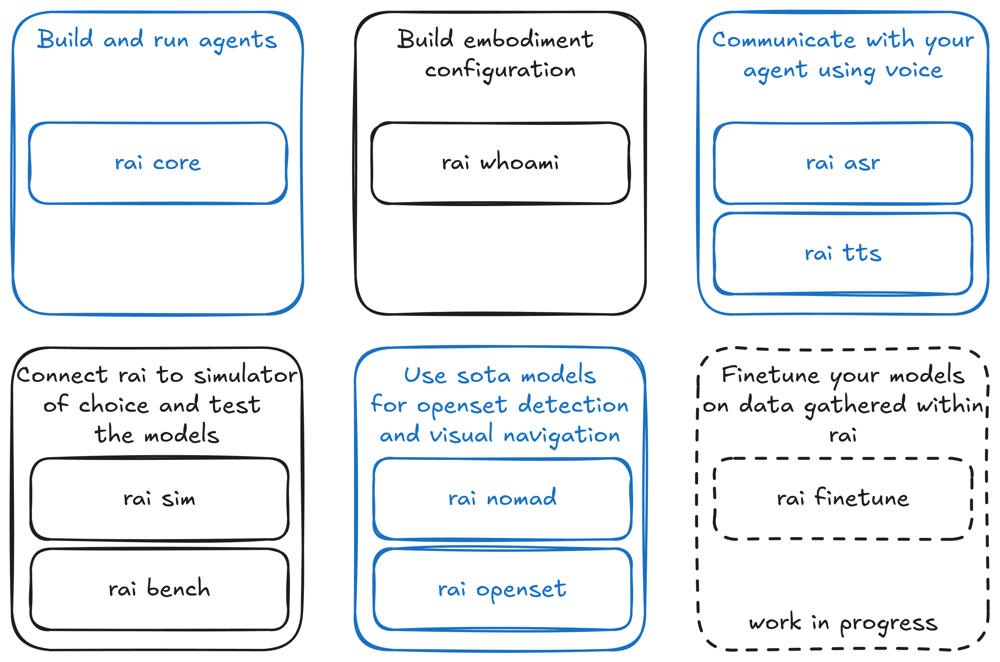

# RAI introduction

RAI is a flexible agentic framework for developing and deploying Embodied AI features for your robots.

RAI enables you to control your robots using natural language and helps them perceive and understand the world with AI. It integrates seamlessly with your current robotics stack to enhance your robots' capabilities.

---

---

    
    
    
     
    
    
    
     
    
    
    
     
    

---

## RAI Framework

The RAI Framework provides a comprehensive, end-to-end solution for developing and deploying sophisticated AI-powered robotic systems. It supports the full lifecycle of embodied AI development, from initial configuration and testing to deployment and continuous improvement.

Our suite of integrated packages enables developers to seamlessly transition from concept to production, offering:

-   **Complete Development Lifecycle**: From initial agent development to deployment
-   **Modular Architecture**: Choose and combine components based on your specific needs
-   **Production-Ready Tools**: Enterprise-grade packages for simulation, testing, and deployment
-   **Extensible Platform**: Easy integration with existing robotics infrastructure and custom solutions
-   **Advanced Human-Robot Interaction**: Through text, speech, and multimodal interfaces
-   **Rich Multimodal Capabilities**: Seamless integration of voice, vision, and sensor data with real-time processing of multiple input/output streams, native handling of diverse data types, and unified multi-sensory perception and action framework.

The framework's components work in perfect harmony to deliver a robust foundation for your robotics projects:

## Getting Started

Ready to dive into RAI? Start with a [quick-setup guide](setup/install.md).

Here are two ways to begin your journey:

### Option 1: Try Our Demos

Experience RAI in action through our interactive demos. These showcase real-world applications across different robotic platforms:

-   🤖 [Manipulation Tasks](demos/manipulation.md) - Watch RAI control a Franka Panda arm using natural language
-   🚗 [Autonomous Navigation](demos/rosbot_xl.md) - Explore RAI's capabilities with the ROSbot XL platform
-   🎤 [Speech Interaction](demos/taxi.md) - Experience RAI's speech-to-speech capabilities in an autonomous taxi scenario
-   🚜 [Agricultural Robotics](demos/agriculture.md) - See how RAI handles complex decision-making in orchard environments

### Option 2: Build Your Own Solution

Follow our comprehensive [**walkthrough**](tutorials/walkthrough.md) to:

-   Deploy RAI on your robot and enable natural language interactions
-   Extend the framework with custom tools and capabilities
-   Implement complex, multi-step tasks using RAI's advanced reasoning

## Communication Protocols

RAI provides first-class support for ROS 2 Humble and Jazzy distributions. While ROS 2 serves as our Tier 1 communication protocol, RAI's architecture includes a powerful abstraction layer that:

-   Simplifies communication across different networks and protocols
-   Enables seamless integration with various communication backends
-   Allows for future protocol extensions while maintaining a consistent interface

This design philosophy means that while RAI is fully compatible with ROS 2, most of its features can be utilized independently of the ROS 2 environment. The framework's modular architecture makes it suitable not only for different robotic platforms but also for non-robotic applications, offering flexibility in deployment across various domains.

### Contributing

You are welcome to contribute to RAI! Please see our [Contribution Guide](faq/contributing/CONTRIBUTING.md).

!!! tip "Want to know more?"

    ## Community

    ### Embodied AI Community Group

    RAI is one of the main projects in focus of the [Embodied AI Community Group](https://github.com/ros-wg-embodied-ai). If you would like to join the next meeting, look for it in the [ROS Community Calendar](https://calendar.google.com/calendar/u/0/embed?src=c_3fc5c4d6ece9d80d49f136c1dcd54d7f44e1acefdbe87228c92ff268e85e2ea0@group.calendar.google.com&ctz=Etc/UTC).

    ### RAI FAQ

    Please take a look at [FAQ](faq/faq.md).

??? tip "RAI at ROSCon 2024"

    
<iframe src="https://player.vimeo.com/video/1026029511?badge=0&amp;autopause=0&amp;player_id=0&amp;app_id=58479" frameborder="0" allow="autoplay; fullscreen; picture-in-picture; clipboard-write; encrypted-media" style="position:absolute;top:0;left:0;width:100%;height:100%;" title="Agent-based AI Framework for ROS 2"></iframe>

??? tip "RAI demos at ROSCon 2024"

    
<iframe src="https://player.vimeo.com/video/1023328281?h=1700a3cb57&amp;badge=0&amp;autopause=0&amp;player_id=0&amp;app_id=58479" frameborder="0" allow="autoplay; fullscreen; picture-in-picture; clipboard-write; encrypted-media" style="position:absolute;top:0;left:0;width:100%;height:100%;" title="RAI - Roscon &#039;24 reel demo"></iframe>

