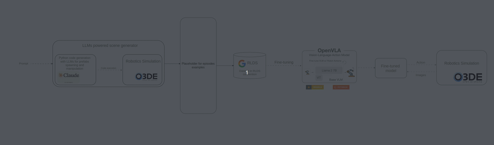

# Robot arm manipulation

## Overview

Vision-Language-Action (VLA) models represent a novel approach to controlling robots,
offering significant potential to automate and generalize robotic operations.
We are working on integrating this approach with RAI to further extend RAI's versatility.

The upcoming manipulation demo will showcase a practical use case where a single prompt can be used to instruct a robotic arm to perform a series of specific tasks.
It is also meant to showcase how a more generalist agent cooperates with a specialized model.

## Currently planned and developed pipeline

### **Automated Dataset Generation**

To automatically generate a dataset with various scenes and robot's actions to fine-tune VLA (Vision-Language-Action) models for generalist robot manipulation policies,
we leverage our [**LLM-powered Scene Generator**](https://github.com/RobotecAI/o3de-genai-gems) enabling easy generation of various scenarios based on user prompts.

**LLM-powered Scene Generator** is an [Open 3D Engine (O3DE)](https://o3de.org/industries/robotics-and-simulations/) Gem that generates the Python code that creates the prompted scene and makes objects make desired actions.
We use the most efficient [Claude models](https://www.anthropic.com/claude) (currently Claude 3.5 Sonnet).

### OpenVLA fine-tuning and inference

We integrated [openVLA](https://openvla.github.io/) model with O3DE and ROS 2.
Our work on Robotic Arm Manipulation Demo is public and available [here](https://github.com/RobotecAI/rai-manipulation-demo).
Instructions on how to run the demo will be released soon.

## Issues and challenges

We are investigating optimal dataset size and diversity to generalize the model for our needs.
As VLA models are quite novel approach, intuitions regarding the fine-tuning of such models are only just being developed.
