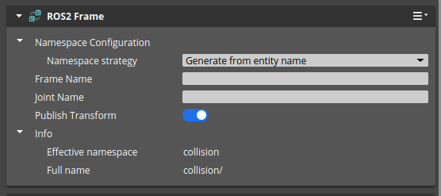

# How to setup an O3DE scene to work with rai_sim

This page is a tutorial on how to set up your O3DE scene to be compatible with the rai_sim and rai_bench frameworks, i.e. to allow for:

- **spawning** and **despawning** objects
- **tracking their position** in real time

O3DE comes with a ROS2 gem that allows for easy integration of your scene with ROS2. We will use the ROS2 Spawner component and ROS2 Frame component to achieve the desired functionality. The ROS2 Spawner component exposes a service that allows you to spawn and despawn objects in the scene, while the ROS2 Frame component put on an entity will publish its position on the /tf topic.

## Requirements

- Ubuntu operating system - the ROS2 gem in O3DE is only supported on Ubuntu

> Note: `o3de` and `o3de-extras` repositories use `git-lfs` to store large files. Make sure to have it set up as described [here](https://github.com/o3de/o3de?tab=readme-ov-file#download-and-install) before cloning the repositories.

- https://github.com/o3de/o3de and https://github.com/o3de/o3de-extras checked out on tag **2409.2**

> Note: If you have never built O3DE before, you will need to follow the instructions in the O3DE documentation to set up your environment and build the engine. First install all the needed dependencies for building O3DE listed here: https://www.docs.o3de.org/docs/welcome-guide/requirements/#linux (make sure to also install `ninja-build`). Then navigate to the O3DE directory and run the following commands: `python/get_python.sh && scripts/o3de.sh register --this-engine`

> Note: If you have never used the ROS2 gem in O3DE, make sure to install all the needed dependencies listed [here](https://www.docs.o3de.org/docs/user-guide/interactivity/robotics/project-configuration/#additional-ros-2-packages-required). Then register the gem as described [here](https://www.docs.o3de.org/docs/user-guide/interactivity/robotics/project-configuration/#additional-ros-2-packages-required).

- an o3de project created ([instructions](https://www.docs.o3de.org/docs/welcome-guide/create/creating-projects-using-cli/creating-linux/)).

## **Step 1. Enable ROS2 gem in your project.**

The ROS2 gem depends on the `PhysX5` gem, which will conflict with the `PhysX` gem that is enabled by default when you create a project in O3DE. Therefore first make sure to have the `PhysX` gem disabled. To do this, enter the directory of your cloned O3DE repository and run the following command:

```bash
scripts/o3de.sh disable-gem -gn PhysX -pp /path/to/your-project/
```

Now you can enable the ROS2 gem:

```bash
scripts/o3de.sh enable-gem -gn ROS2 -pp /path/to/your-project/
```

## **Step 2. Build the Editor and open it**

```bash
cd /path/to/your-project/
cmake -B build/linux -S . -G "Ninja Multi-Config" -DLY_STRIP_DEBUG_SYMBOLS=TRUE -DLY_DISABLE_TEST_MODULES=ON
cmake --build build/linux --config profile --target Editor -j 22
./build/linux/bin/profile/Editor
```

## **Step 3. Set up your spawnable prefabs**

- Create an entity in the scene that you want to make spawnable. For example, to create a simple entity that interacts with the physical environment, you can:
  - Right-click in the _entity manager_ and click _Create entity_.
  - Select the entity and in the _inspector window_ add _PhysX Dynamic Rigid Body_, _Box Shape_ and _PhysX Shape Collider_ components to it.
- Select the entity you want to track in the _entity manager_ and add the `ROS2 Frame component` in the _inspector window_; configure it as follows:



Leave the frame name and joint name empty, set namespace strategy to “Generate from entity name” and check “Publish transform”.

- Right-click on the entity name in the _entity manager_ to save the object as a prefab


You can now delete your entity from the scene.

## **Step 4. Setup ROS2 Spawner**

- Create an empty entity and add a ROS2 spawner component to it.


- Click the “+” icon inside the ROS2 Spawner component window


- Enter the **name by which you will later refer to the object to spawn it**


- Click on the little folder icon that appeared next to your object’s name


- Navigate to the place where you saved your prefab and choose it here and click “OK”


### **Repeat steps 3. and 4. for each object that you want to make spawnable.**

Now, when you press play in the Editor, you should be able to spawn new objects by calling the `/spawn_entity` service, like so:

```bash
ros2 service call /spawn_entity gazebo_msgs/srv/SpawnEntity "{name: 'apple', initial_pose: {position:{ x: 0.0, y: 0.0, z: 0.2 }, orientation: { x: 0.0, y: 0.0, z: 0.0, w: 1.0 } } }"
```

The response should look like this:

```bash
response:
gazebo_msgs.srv.SpawnEntity_Response(success=True, status_message='apple_5')
```

Then you should be able to see your object's position on the `/tf` topic by running:

```bash
ros2 topic echo /tf
```

The output should look like this:

```bash
transforms:
- header:
    stamp:
      sec: 163
      nanosec: 66984981
    frame_id: apple_1/odom
  child_frame_id: apple_1/
  transform:
    translation:
      x: -2.6995063308277167e-05
      y: -2.1816253138240427e-05
      z: 0.0499994121491909
    rotation:
      x: 2.1038686099927872e-05
      y: -5.1415558118605986e-05
      z: -3.404247763683088e-05
      w: 1.0
---
```

If these commands work for you, your scene is successfully set up and ready to be used with rai_sim. You can now build the binary package and run it with rai_sim.

## Step 5. Building the GameLauncher

To run your simulation with rai_sim, you need to build the binary package. To do this, you need to build the GameLauncher. Run the following command inside the project directory:

```bash
cmake --build build/linux --config profile --target YourProjectName.GameLauncher -j 22
```

The GameLauncher will be ready to run inside the `build/linux/bin/profile` directory with the name `YourProjectName.GameLauncher`.

## Step 6. (Optional) Building the Monolithic package

If you want to make a portable package that can be run on a different machine, you can build the Monolithic package. To do this, run the following commands inside the project directory:

```bash
cmake -B build/linux_mono -S . -G "Ninja Multi-Config" -DLY_MONOLITHIC_GAME=1
cmake --build build/linux_mono --config release --target install -j 22
```

The package should now be ready to run in the `install/bin/Linux/release/Monolithic` directory inside your project.
