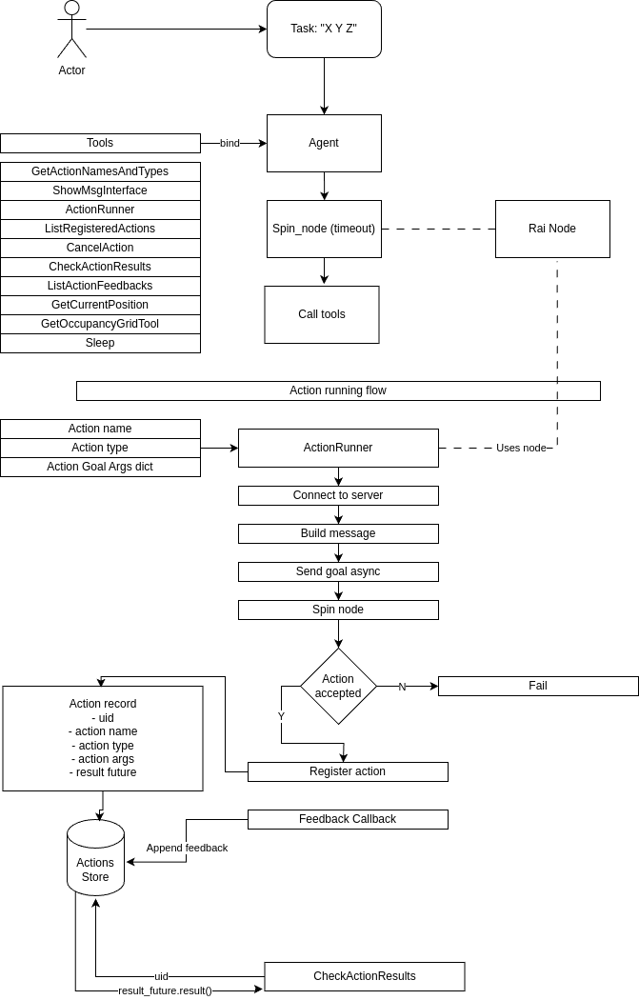

# Using ROS2 Actions

This tutorial describes how `RAI` can run and check status of ros2 actions.

## Flow diagram



## Fibonacci action example

### Installation

```bash
. /opt/ros/${ROS_DISTRO}/setup.bash
mkdir tmp
cd tmp
git clone --branch ${ROS_DISTRO} https://github.com/ros2/demos
cp -r demos/action_tutorials/action_tutorials_py ../examples
cd ..
rm -rdf tmp  #TODO(boczekbartek): refactor installation of examples
```

### Build

```bash
colcon build --symlink-install --cmake-args -D CMAKE_BUILD_TYPE=Release
poetry install
```

### Running

This will require opening 2 terminals and running the following commands

1. Run the action server

   ```bash
   . /opt/ros/${ROS_DISTRO}/setup.bash # for e.g. ROS_DISTRO=jazzy
   . ./install/setup.bash
   ros2 run action_tutorials_py fibonacci_action_server
   ```

2. Run the action `RAI` example

   ```bash
   . /opt/ros/${ROS_DISTRO}/setup.bash
   . ./install/setup.bash
   poetry shell
   python examples/simple_example_ros_actions.py
   ```

## Nav2 Gazebo + Turtlebot

### Installation

Please refer to [Nav2 Installation][nav2 installation]

```bash
. /opt/ros/${ROS_DISTRO}/setup.bash # for e.g. ROS_DISTRO=jazzy
. ./install/setup.bash
poetry shell
python simple_example_ros_actions.py
```

### Running

To Run Gazebo and Navigation2 stack refer to [Nav2 Running The Example][nav2 running the example]

To run the `RAI` example:

```bash
. /opt/ros/${ROS_DISTRO}/setup.bash # for e.g. ROS_DISTRO=jazzy
. ./install/setup.bash
poetry shell
python examples/nav2_example_ros_actions.py
```

## Husarion ROSBot XL O3DE example

### Installation

Please refer to [rai rosbot xl demo][rai rosbot xl demo] to run the simulation.

### Running

You can set the task for the agent in the `examples/nav2_example_ros_actions.py` file.

```bash
. /opt/ros/${ROS_DISTRO}/setup.bash # for e.g. ROS_DISTRO=jazzy
. ./install/setup.bash
poetry shell
python examples/nav2_example_ros_actions.py
```

[nav2 installation]: https://docs.nav2.org/getting_started/index.html#installation
[nav2 running the example]: https://docs.nav2.org/getting_started/index.html#running-the-example
[rai rosbot xl demo]: https://github.com/RobotecAI/rai-rosbot-xl-demo
