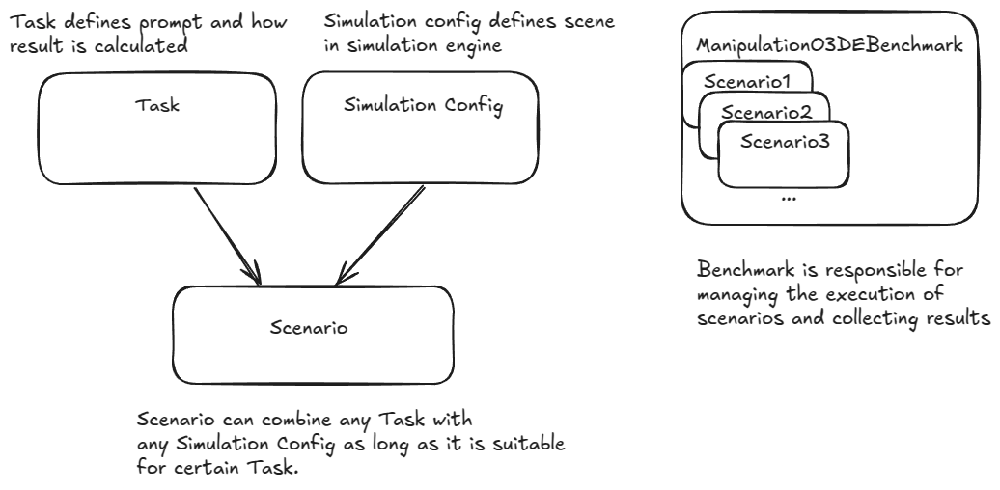
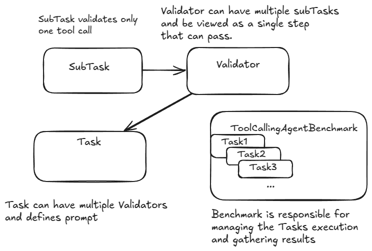

# RAI Bench

RAI Bench is a comprehensive package that both provides benchmarks with ready-to-use tasks and offers a framework for creating new tasks. It's designed to evaluate the performance of AI agents in various environments.

### Available Benchmarks

-   [Manipulation O3DE Benchmark](#manipulation-o3de-benchmark)
-   [Tool Calling Agent Benchmark](#tool-calling-agent-benchmark)

## Manipulation O3DE Benchmark

Evaluates agent performance in robotic arm manipulation tasks within the O3DE simulation environment. The benchmark evaluates how well agents can process sensor data and use tools to manipulate objects in the environment.

### Framework Components

Manipulation O3DE Benchmark provides a framework for creating custom tasks and scenarios with these core components:



### Task

The `Task` class is an abstract base class that defines the interface for tasks used in this benchmark.
Each concrete Task must implement:

-   prompts that will be passed to the agent
-   validation of simulation configurations
-   calculating results based on scene state

### Scenario

A `Scenario` represents a specific test case combining:

-   A task to be executed
-   A simulation configuration

### ManipulationO3DEBenchmark

The `ManipulationO3DEBenchmark` class manages the execution of scenarios and collects results. It provides:

-   Scenario execution management
-   Performance metrics tracking
-   Logs and results
-   Robotic stack needed, provided as `LaunchDescription`

### Available Tasks

The benchmark includes several predefined manipulation tasks:

1. **MoveObjectsToLeftTask** - Move specified objects to the left side of the table

2. **PlaceObjectAtCoordTask** - Place specified objects at specific coordinates

3. **PlaceCubesTask** - Place specified cubes adjacent to each other

4. **BuildCubeTowerTask** - Stack specified cubes to form a tower

5. **GroupObjectsTask** - Group specified objects of specified types together

Tasks are parametrizable so you can configure which objects should be manipulated and how much precision is needed to complete a task.

Tasks are scored on a scale from 0.0 to 1.0, where:

-   0.0 indicates no improvement or worse placement than the starting one
-   1.0 indicates perfect completion

The score is typically calculated as:

```
score = (correctly_placed_now - correctly_placed_initially) / initially_incorrect
```

### Available Scene Configs and Scenarios

You can find predefined scene configs in `rai_bench/manipulation_o3de/predefined/configs/`.

Predefined scenarios can be imported like:

```python
from rai_bench.manipulation_o3de import get_scenarios

get_scenarios(levels=["easy", "medium"])
```

Choose which task you want by selecting the difficulty, from trivial to very hard scenarios.

## Tool Calling Agent Benchmark

Evaluates agent performance independently from any simulation, based only on tool calls that the agent makes. To make it independent from simulations, this benchmark introduces tool mocks which can be adjusted for different tasks. This makes the benchmark more universal and a lot faster.

### Framework Components



### SubTask

The `SubTask` class is used to validate just one tool call. Following classes are available:

-   `CheckArgsToolCallSubTask` - verify if a certain tool was called with expected arguments
-   `CheckTopicFieldsToolCallSubTask` - verify if a message published to ROS 2topic was of proper type and included expected fields
-   `CheckServiceFieldsToolCallSubTask` - verify if a message published to ROS 2service was of proper type and included expected fields
-   `CheckActionFieldsToolCallSubTask` - verify if a message published to ROS 2action was of proper type and included expected fields

### Validator

The `Validator` class can combine single or multiple subtasks to create a single validation step. Following validators are available:

-   OrderedCallsValidator - requires a strict order of subtasks. The next subtask will be validated only when the previous one was completed. Validator passes when all subtasks pass.
-   NotOrderedCallsValidator - doesn't enforce order of subtasks. Every subtask will be validated against every tool call. Validator passes when all subtasks pass.

### Task

A Task represents a specific prompt and set of tools available. A list of validators is assigned to validate the performance.

??? info "Task class definition"

    ::: rai_bench.tool_calling_agent.interfaces.Task

As you can see, the framework is very flexible. Any SubTask can be combined into any Validator that can be later assigned to any Task.

### ToolCallingAgentBenchmark

The ToolCallingAgentBenchmark class manages the execution of tasks and collects results.

### Available Tasks

Tasks of this benchmark are grouped by type:

-   Basic - basic usage of tools
-   Navigation
-   Manipulation
-   Custom Interfaces - requires using messages with custom interfaces

If you want to know details about every task, visit `rai_bench/tool_calling_agent/tasks`

## Test Models
