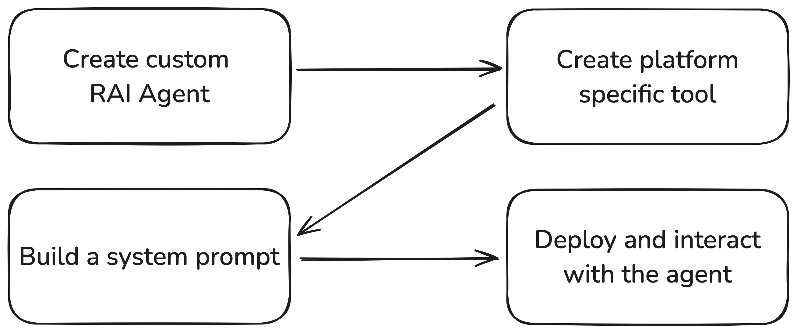

# RAI Walkthrough - from zero to a custom agent



## Overview

This guide demonstrates how to create and deploy a RAI agent on a ROS 2 enabled robot. You'll learn
how to:

- Create a new, custom RAI Agent from scratch
- Implement a platform-specific tool for robot control
- Build a system prompt using rai whoami
- Deploy and interact with the agent

### Prerequisites

Before proceeding, ensure you have:

- RAI installed and configured
- ROS 2 installed and properly set up

## Creating a Custom Agent

In this section, we'll create a new agent from scratch using the ReAct agent. While pre-built ROS
2-compatible agents exist in RAI, this example will help you understand the underlying architecture
and customization options.

The underlying ReAct agent combines language models with a set of tools to solve complex problems.
Our Agent implementation adds robot status monitoring, which controls agent execution based on the
robot's state.

```python
from typing import List

from langchain_core.runnables import RunnableConfig
from langchain_core.tools import BaseTool
from rai.agents import BaseAgent
from rai.agents.langchain import (
    HRICallbackHandler,
    ReActAgentState,
    create_react_runnable,
)
from rai.communication.ros2 import (
    ROS2Connector,
    ROS2HRIConnector,
    ROS2HRIMessage,
    ROS2Message,
)
from rai.messages.multimodal import SystemMultimodalMessage


class PandaAgent(BaseAgent):
    def __init__(
        self,
        connector: ROS2Connector,
        tools: List[BaseTool],
        system_prompt: SystemMultimodalMessage,
        input_topic: str,
        output_topic: str,
    ):
        super().__init__()
        self.connector = connector

        # Initialize the ROS 2 HRI (Human-Robot Interface) connector
        # This handles bidirectional communication with human-facing topics
        self.hri_connector = ROS2HRIConnector()

        # Create a ReAct agent with the provided tools and system prompt
        self.agent = create_react_runnable(
            tools=tools,
            system_prompt=system_prompt,
        )
        # Initialize the agent's state with an empty message history
        self.state = ReActAgentState(messages=[])

        # Set up the callback handler to route agent outputs to ROS 2 topics
        self.callback_handler = HRICallbackHandler(
            connectors={output_topic: self.hri_connector},
        )

        # Register the input callback for distributed operation
        # For simpler setups, you can directly call self.agent.invoke() in a loop
        self.hri_connector.register_callback(input_topic, self.input_callback)

        # Monitor the robot's status topic to control agent execution
        # The agent will only process messages when the arm is ready
        self.arm_ready = False
        self.connector.register_callback("/panda_status", self.monitor_status_topic)

    def monitor_status_topic(self, msg: ROS2Message):
        """Update the arm readiness status based on the status message."""
        if msg.payload.status == "ready":
            self.arm_ready = True
        else:
            self.arm_ready = False

    def input_callback(self, message: ROS2HRIMessage):
        """Process incoming messages when the arm is ready."""
        if self.arm_ready:
            self.state["messages"].append(message.to_langchain())
            self.agent.invoke(
                self.state, config=RunnableConfig(callbacks=[self.callback_handler])
            )
        else:
            self.logger.warning("Arm is not ready, skipping the message")

    def run(self):
        """Start the agent's main execution loop."""
        pass

    def stop(self):
        """Clean up resources and shut down connections."""
        self.connector.shutdown()
        self.hri_connector.shutdown()

```

## Implementing Platform-Specific Tools

This section demonstrates how to implement a custom tool for safely shutting down the robot arm. The
tool showcases how to integrate platform-specific functionality into the RAI framework.

For comprehensive information about tool implementation in RAI, refer to the
[tools documentation](./tools.md).

```python
from typing import Literal, Type

from pydantic import BaseModel, Field
from rai.communication.ros2 import ROS2Message
from rai.tools.ros2.base import BaseROS2Tool


# Define the input schema for the tool
class ShutdownArmToolInput(BaseModel):
    level: Literal["soft", "hard"] = Field(
        default="soft",
        description="The level of shutdown to perform",
    )


# Define the tool
class ShutdownArmTool(BaseROS2Tool):
    """Tool for safely shutting down the robot arm."""
    name: str = "shutdown_arm"
    description: str = "Shutdown the arm"
    args_schema: Type[ShutdownArmToolInput] = ShutdownArmToolInput

    def _run(self, level: Literal["soft", "hard"]) -> str:
        """Execute the arm shutdown command.

        Args:
            level: The shutdown level - "soft" for graceful shutdown, "hard" for immediate shutdown

        Returns:
            str: Status message indicating success or failure
        """
        response = self.connector.service_call(
            ROS2Message(
                payload={"level": level}
            ),
            target="/panda_arm/shutdown",
            msg_type="rai_interfaces/ShutdownArm",
        )
        if response.payload.success:
            return "Arm shutdown successful"
        else:
            return "Arm shutdown failed"
```

## Building the System Prompt

The `rai whoami` utility generates a system prompt based on your robot's specifications. It requires
a directory containing:

- Documentation
- Images
- URDF files

!!! tip "Directories are optional" While each directory is optional, providing comprehensive
information about your robot will result in a more accurate and effective system prompt.

### Setting Up the Robot Directory

Create a `panda/` directory with the following structure:

1. **Images**

   - Save [this image](https://robodk.com/robot/img/Franka-Emika-Panda-robot.png) in `panda/images`

2. **Documentation**

   - Save
     [this document](https://github.com/user-attachments/files/16417196/Franka.Emika.Panda.robot.-.RoboDK.pdf)
     in `panda/documentation`

3. **URDF**
   - Save
     [this URDF](https://github.com/frankaemika/franka_ros/blob/develop/franka_description/robots/panda/panda.urdf.xacro)
     in `panda/urdf`

### Building the Whoami

Run the following command to build the whoami:

```bash
python src/rai_whoami/rai_whoami/build_whoami.py panda/ --build-vector-db
```

## Running the Agent

```python
from rai_whoami.models import EmbodimentInfo
from rai.agents import wait_for_shutdown
from rai.communication.ros2 import ROS2Context, ROS2Connector
from rai.tools.ros2 import ROS2Toolkit


@ROS2Context()  # Initializes ROS 2 context and ensures proper cleanup on exit
def main():
    # Load the robot's embodiment information from the whoami directory
    whoami = EmbodimentInfo.from_directory("panda/")
    connector = ROS2Connector()

    # Initialize tools with ROS 2 communication capabilities
    # BaseROS2Tools require a ROS2Connector instance for communication
    tools = [
        ShutdownArmTool(connector=connector),
        *ROS2Toolkit(connector=connector).get_tools(),
    ]

    # Create and configure the agent with all necessary components
    agent = PandaAgent(
        connector=connector,
        tools=tools,
        system_prompt=whoami.to_langchain(),
        input_topic="/from_human",
        output_topic="/to_human",
    )

    # Start the agent and wait for shutdown signal (Ctrl+C)
    wait_for_shutdown([agent])

if __name__ == "__main__":
    main()
```

### Communicating with the Agent

The agent exposes two main communication channels:

1. **Sending Commands**

   ```bash
   ros2 topic pub /from_human rai_interfaces/msg/HRIMessage "{\"text\": \"Move the arm to 0, 0, 0?\"}"
   ```

2. **Receiving Responses**

   ```bash
   ros2 topic echo /to_human rai_interfaces/msg/HRIMessage
   ```
