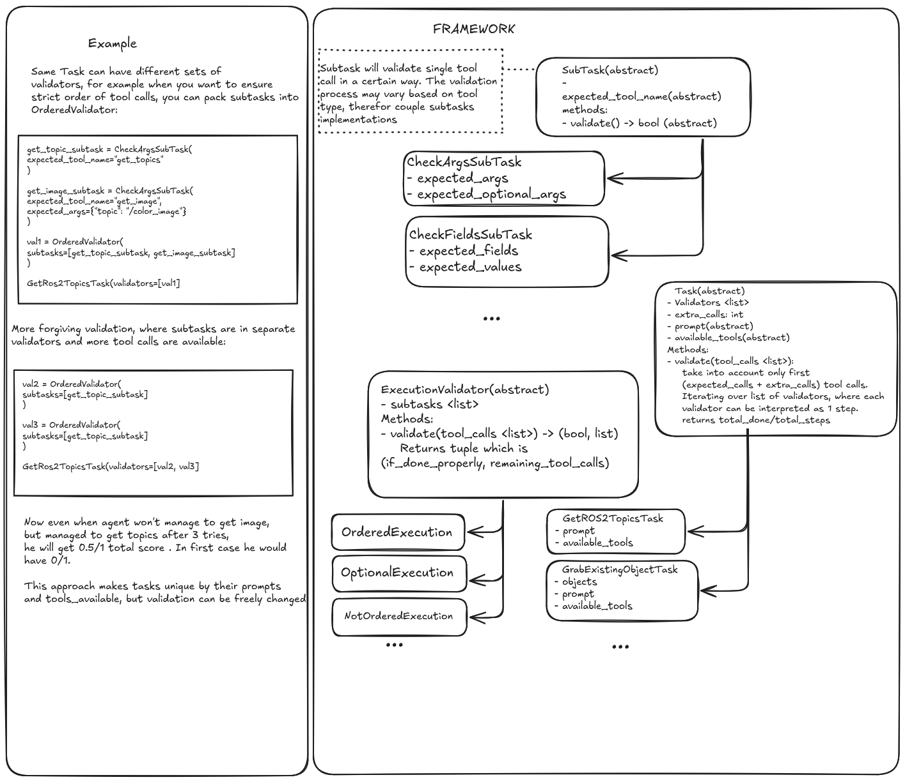

# Tool Calling Agent Benchmark

## Validaiton

Our validation flow consists of:

-   SubTask - smallest block, responsible for validating single tool call (ex. ListTopics)
-   Validator - consists of subtasks. Based on the validator type, checks whether all subtasks were completed in a certain way
-   Task - consists of validators. Every Validator can be treated as single step that is scored atomically. Visit examples/tool_calling_agent/tasks.py for more intuition. Every Task has always the same prompt and available tools, only the validation methods can be parametrized. On top of validator, you can pass extra_tool_calls param to allow model to correct itself.

Implementations can be found:

-   Validators [Validators](../tool_calling_agent/validators.py)
-   Subtasks [Validators](../tool_calling_agent/tasks/subtasks.py)
-   Tasks, including navigation, spatial, custom interfaces and other [Tasks](../tool_calling_agent/tasks/)
