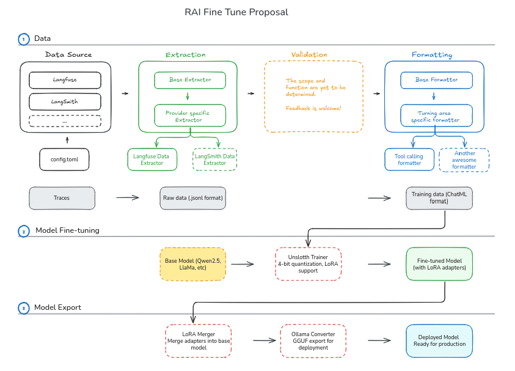

# RAI Fine-tuning Module

## Module Overview

This module provides tools for extracting and formatting training data from various providers such as Langfuse and LangSmith. The formatted training data is designed to work seamlessly with Unsloth for efficient fine-tuning. It includes:

**Data Preparation:**

-   **Observation Extractors**: Extract observations from various sources (Langfuse, LangSmith) with standardized preprocessing
-   **Training Data Formatter**: Converts RAI observations to training data format in ChatML format for Unsloth compatibility

It is recommended for extractors to adopt a standardized data format based on Langfuse structure. Langfuse format was chosen as the standardization target because it provides cleaner, more direct access to conversation data with flat message structures (`input`/`output` fields) that closely match the target ChatML format. This reduces preprocessing complexity and makes the formatter more maintainable compared to handling raw LangSmith data with deeply nested LangChain internal structures.

Data from different sources (e.g., LangSmith) can be preprocessed at the extraction level to ensure consistent formatting. For example, LangSmith data with nested message structures and different field names is converted to the standard format before reaching the formatter, maintaining a single, reusable formatter for all data sources.

Formatter follows OpenAI recommendation on [data formatting](https://platform.openai.com/docs/guides/supervised-fine-tuning#formatting-your-data) for fine tuning. 

**Fine-tune Helpers:**

To be added. It includes:

-   **Model Fine-tuning**: Uses Unsloth for optimized training with 4-bit quantization and LoRA support
-   **LoRA Merger**: Merges LoRA adapter weights back into base models for standalone deployment
-   **Ollama Converter**: Converts fine-tuned models to Ollama format using GGUF export

The module is designed as a standalone package to avoid dependency conflicts between different versions of Triton required by openai-whisper and unsloth-zoo.

**System Component Proposal**: (Feedback is welcome and appreciated!)


<div style="text-align: center; padding: 20px;"></div>

Folder Structure (Tenatative)

```
src/rai_finetune/rai_finetune/
├── data/                 # Data processing
│   ├── formatters/       # Data formatting
│   ├── extractors/       # Data extraction
│   ├── validators/       # Data validation (To be implemented)
├── utils/                # Utilities
│   ├── chat_template.py  # Chat templates
│   ├── templates/        # Template files
│   └── model_loader.py   # Base model loading (from ModelManager, to be implemented)
├── adapters/             # LoRA management
│   ├── merger.py         # LoRA merging (To be implemented)
│   └── config.py         # Adapter configs (To be implemented)
├── trainers/             # Training orchestration
│   ├── trainer.py        # Main trainer (To be implemented)
│   └── data_loader.py    # Data preparation (To be implemented)
└── exporters/            # Model export
    ├── ollama.py         # Ollama export (To be implemented)
    └── gguf.py           # GGUF export (To be implemented)
```

## Environment Setup

This module utilizes `unsloth` which works with Python 3.10, 3.11, and 3.12. Python 3.12+ has Dynamo compatibility issues with `unsloth`; see [issue reference](https://github.com/unslothai/unsloth/issues/886). Thus Python 3.10 is selected for its compatibility with the rest of RAI components. The instructions below are targeted for Linux.

### 1. Install System Dependencies

```bash
sudo apt update
sudo apt install -y \
    libncurses5-dev \
    libncursesw5-dev \
    libreadline-dev \
    libsqlite3-dev \
    libssl-dev \
    zlib1g-dev \
    libbz2-dev \
    libffi-dev \
    liblzma-dev \
    libgdbm-dev \
    libnss3-dev \
    libtinfo6 \
    build-essential
```

### 2. Install Python 3.10 with pyenv

Use pyenv to manage Python versions:

```bash
# Install pyenv if not already installed
curl https://pyenv.run | bash

# Add to shell profile
echo 'export PYENV_ROOT="$HOME/.pyenv"' >> ~/.bashrc
echo 'command -v pyenv >/dev/null || export PATH="$PYENV_ROOT/bin:$PATH"' >> ~/.bashrc
echo 'eval "$(pyenv init -)"' >> ~/.bashrc

# Reload shell or source profile
source ~/.bashrc

# Install Python 3.10
pyenv install 3.10
```

### 3. Set up Poetry Environment

```bash
cd src/rai_finetune

# Set local Python version
pyenv local 3.10

# Install Poetry if not already installed
curl -sSL https://install.python-poetry.org | python3 -

# Create and activate Poetry environment
poetry env use python
poetry install
poetry run pip install flash-attn --no-build-isolation

# Activate the environment
. ./setup_finetune_shell.sh
```

### 4. Install llama.cpp Tools (Optional)

The Ollama conversion process requires the `llama-quantize` tool from llama.cpp. To handle this, developers can:

```bash
# Clone and build llama.cpp at project root
git clone https://github.com/ggerganov/llama.cpp.git
cd llama.cpp
mkdir build && cd build
cmake ..
cmake --build . --config Release
# The llama-quantize tool will be in the build/bin directory
```

## CLI Usage

The module provides a unified command-line interface for data operations:

```bash
# Show general help
python -m rai_finetune.data_cli --help

# Show help for specific extractors
python -m rai_finetune.data_cli extract langfuse --help
python -m rai_finetune.data_cli format --help
```

## Script Execution Flow

Before running any scripts, make sure the shell is set up properly by running the following from the root folder of the project:

```bash
source src/rai_finetune/setup_finetune_shell.sh
```

### 1. Observation Extraction

Extract observations from Langfuse for specific models using the CLI:

```bash
python -m rai_finetune.data_cli extract langfuse \
    --models "gpt-4o" \
    --models "gpt-4o-mini" \
    --output langfuse_raw_data.jsonl \
    --max-data-limit 5000
```

With start and stop time filters:

```bash
python -m rai_finetune.data_cli extract langfuse \
    --models "gpt-4o" \
    --start-time "2025-08-01T00:00:00Z" \
    --stop-time "2025-08-31T23:59:59Z" \
    --output langfuse_raw_data_filtered.jsonl

```

**CLI Options:**

**Langfuse Options:**

-   `--models`: List of model names to extract observations from
-   `--output`: Output file for extracted observations (required)
-   `--page-size`: Page size for pagination (default: 50)
-   `--start-time`: Start time for data extraction (ISO format)
-   `--stop-time`: Stop time for data extraction (ISO format)
-   `--max-data-limit`: Maximum number of records to extract (default: 5000)
-   `--host`: Langfuse host URL (default: http://localhost:3000)
-   `--public-key`: Langfuse public key (or set LANGFUSE_PUBLIC_KEY env var)
-   `--secret-key`: Langfuse secret key (or set LANGFUSE_SECRET_KEY env var)
-   `--type-filter`: Observation type filter (default: GENERATION)
-   `--trace-id`: Restrict to specific trace ID
-   `--include-fields`: Fields to include in saved data samples

**Environment Variables:**
You can set Langfuse credentials as environment variables to avoid passing them on the command line:

```bash
export LANGFUSE_PUBLIC_KEY="your_public_key"
export LANGFUSE_SECRET_KEY="your_secret_key"
```

### 2. Training Data Preparation

For tool calling fine-tuning using the CLI, format data samples using

Format data for training:

```bash
python -m rai_finetune.data_cli format \
    --input  langfuse_raw_data.jsonl \
    --output langfuse_tc_data.jsonl \
    --system-prompt "You are a specialized AI assistant for robotics and tool calling tasks."
```

**CLI Options:**

-   `--input`: Input observations file (required)
-   `--output`: Output training data file (required)
-   `--system-prompt`: System prompt to use (default: "You are a helpful AI assistant that can use tools to help users.")
-   `--system-prompt`: System prompt to use (default: "You are a helpful AI assistant that can use tools to help users.")
-   `--system-prompt-file`: Path to file containing custom system prompt
