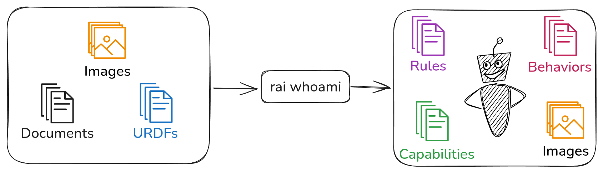

# RAI Whoami



## Overview

**RAI Whoami** is a Python package designed to extract and synthesize robot embodiment information from a structured directory of documentation, images, and URDFs.  
It generates a comprehensive system prompt (embodiment info) for robots controlled by LLMs, enabling advanced reasoning guided by the robot's embodiment setup.

---

## How It Works

Given a directory containing robot documentation (documents, images, URDFs), RAI Whoami processes these resources to produce a structured representation of the robot, including:

- **Rules**: Extracted operational or safety rules.
- **Behaviors**: Descriptions of robot behaviors.
- **Capabilities**: Functional and physical capabilities.
- **Images**: Visual representations.
- **Vector Database**: Embeddings of the robot's documentation. (optional)

This embodiment info is then used to create a system prompt for LLM-based agents, enabling them to reason about and interact with the robot effectively.

### Directory Structure

Prepare your robot documentation directory as follows:

```
documentation_dir/
├── images/          # png, jpg, jpeg files
├── documentation/   # pdf, docx, doc, md files
├── urdf/            # urdf files
```

### Building the Embodiment Info

To generate the system prompt from your documentation directory:

```bash
python src/rai_whoami/rai_whoami/build_whoami.py documentation_dir [--output_dir output_dir] [--build-vector-db]
```

Generated files will be saved in the `output_dir / generated directory` or `documentation_dir / generated` if not specified.

---

## Using with ROS2 and ReActAgent

Integrate the generated embodiment info into your LLM-powered robot agent:

```python
from rai_whoami import EmbodimentInfo
from rai.agents import ReActAgent, wait_for_shutdown
from rai.communication.ros2 import ROS2HRIConnector

info = EmbodimentInfo.from_directory("output_dir/")
system_prompt = info.to_langchain()  # Convert EmbodimentInfo to a system prompt

# example usage with langchain runnable
from rai.agents.langchain import create_react_runnable

react_agent = create_react_runnable(
    tools=[],
    system_prompt=system_prompt
)

# example usage with RAI Agent
connector = ROS2HRIConnector()
agent = ReActAgent(
    target_connectors={"/to_human": connector},
    system_prompt=system_prompt,
)

agent.run()
connector.register_callback("/from_human", agent)
wait_for_shutdown([agent])
```

## Using generated Vector Database

rai whoami provides a langchain tool to query the generated vector database. There are a couple of ways to use it:

1. Through a langchain runnable

```python
from langchain_core.messages import HumanMessage
from rai_whoami.tools import QueryDatabaseTool
from rai.agents.langchain import create_react_runnable

query_tool = QueryDatabaseTool(root_dir="output_dir/generated")

react_agent = create_react_runnable(tools=[query_tool])
print(
    react_agent.invoke(
        {"messages": [HumanMessage(content="Check the db for Robot's name")]}
    )
)
```

2. Through a RAI Agent

```python
from rai.agents import ReActAgent, wait_for_shutdown
from rai.communication.ros2 import ROS2HRIConnector

from rai_whoami.tools import QueryDatabaseTool

query_tool = QueryDatabaseTool(root_dir="output_dir/generated")

connector = ROS2HRIConnector()
agent = ReActAgent(
    target_connectors={"/to_human": connector}, system_prompt="", tools=[query_tool]
)
agent.run()
connector.register_callback("/from_human", agent)
wait_for_shutdown([agent])

```
